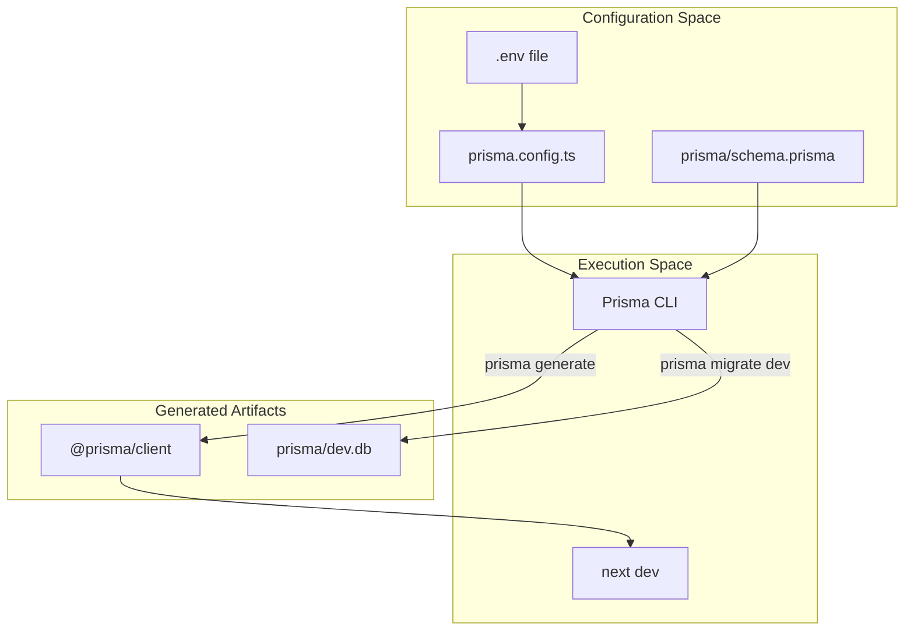
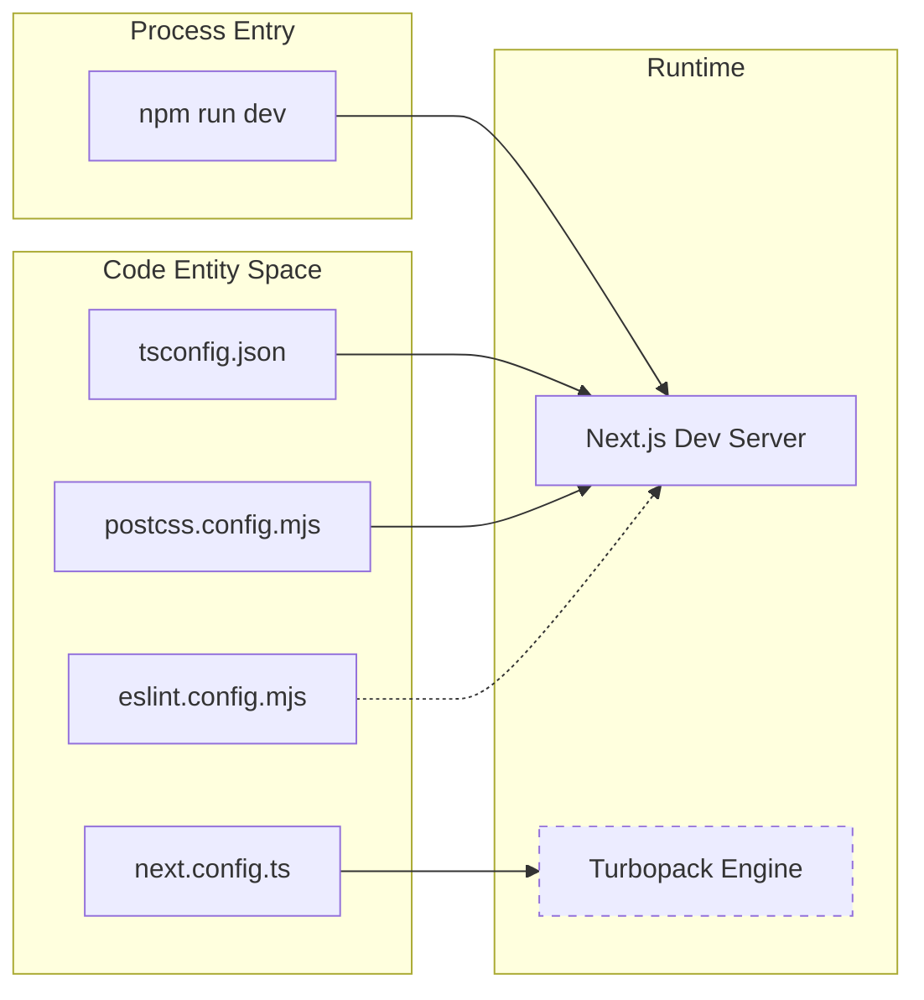

# Getting Started — Setup & Configuration

<details>
<summary>Relevant source files</summary>

The following files were used as context for generating this wiki page:

- [.gitignore](.gitignore)
- [eslint.config.mjs](eslint.config.mjs)
- [next.config.ts](next.config.ts)
- [package.json](package.json)
- [postcss.config.mjs](postcss.config.mjs)
- [prisma.config.ts](prisma.config.ts)
- [tsconfig.json](tsconfig.json)

</details>


This page provides a technical walkthrough for setting up the Animeverse development environment. It covers dependency management, environment configuration, database initialization via Prisma, and the local execution lifecycle.

## 1. Environment Prerequisites

Animeverse is built on **Next.js 16** and requires a Node.js environment compatible with the dependencies defined in `package.json`.

### Dependency Installation
The project uses `npm` for package management. Key dependencies include:
*   **Next.js**: Framework for frontend and API routes [package.json:17]().
*   **Prisma**: ORM for database interactions [package.json:13,29]().
*   **SimpleWebAuthn**: Server and browser libraries for Passkey support [package.json:14-15]().
*   **Tailwind CSS**: Utility-first CSS framework [package.json:30]().

To install dependencies, run:
```bash
npm install
```
Upon installation, a `postinstall` script automatically executes `prisma generate` to build the Prisma Client based on the schema [package.json:10]().

**Sources:**
* [package.json:1-33]()

---

## 2. Configuration & Environment Variables

The application relies on environment variables for database connectivity and authentication security. These should be defined in a `.env` file in the root directory (ignored by git [ .gitignore:34]()).

### Key Variables
| Variable | Purpose | Default / Example |
| :--- | :--- | :--- |
| `DATABASE_URL` | Connection string for the PostgreSQL or SQLite database. | `file:./dev.db` [prisma.config.ts:14]() |
| `RP_ID` | Relying Party ID for WebAuthn (usually the domain). | `localhost` |
| `RP_NAME` | Display name for the WebAuthn service. | `Animeverse` |

### Prisma Configuration
The `prisma.config.ts` file uses `dotenv` to load these variables and configures the schema path and migration directory [prisma.config.ts:4-11]().

**Sources:**
* [.gitignore:34]()
* [prisma.config.ts:4-16]()

---

## 3. Database Initialization

Animeverse uses Prisma for schema management. The default configuration supports a local SQLite file (`dev.db`) for development if no `DATABASE_URL` is provided [prisma.config.ts:14]().

### Setup Flow
1.  **Generate Client**: Done automatically via `postinstall`, but can be manually triggered using `npx prisma generate`.
2.  **Migrations**: To sync the database schema with `prisma/schema.prisma`, run:
    ```bash
    npx prisma migrate dev --name init
    ```
3.  **Studio**: To inspect data visually, use `npx prisma studio`.

### System Initialization Diagram
This diagram illustrates the relationship between the configuration files and the generated artifacts.

**Configuration to Artifact Flow**


**Sources:**
* [package.json:10-13]()
* [prisma.config.ts:7-16]()
* [.gitignore:49-50]()

---

## 4. Development Server Lifecycle

Once dependencies are installed and the database is migrated, the development server can be started.

### Available Scripts
*   `npm run dev`: Starts the Next.js development server [package.json:6]().
*   `npm run build`: Compiles the application for production [package.json:7]().
*   `npm run lint`: Runs ESLint using the custom configuration in `eslint.config.mjs` [package.json:9, eslint.config.mjs:1-18]().

### Local Directories
The project structure includes specific directories for runtime assets:
*   `/public/uploads`: Local storage for user-uploaded media (ignored by git) [.gitignore:46]().
*   `/.next/`: Build cache and development artifacts [.gitignore:17]().

### Execution Data Flow
The following diagram maps the entry points and configuration files to the running process.

**Dev Server Process Mapping**


**Sources:**
* [package.json:5-11]()
* [next.config.ts:4-8]()
* [tsconfig.json:1-34]()
* [postcss.config.mjs:1-7]()
* [eslint.config.mjs:5-18]()
* [.gitignore:46]()

---
