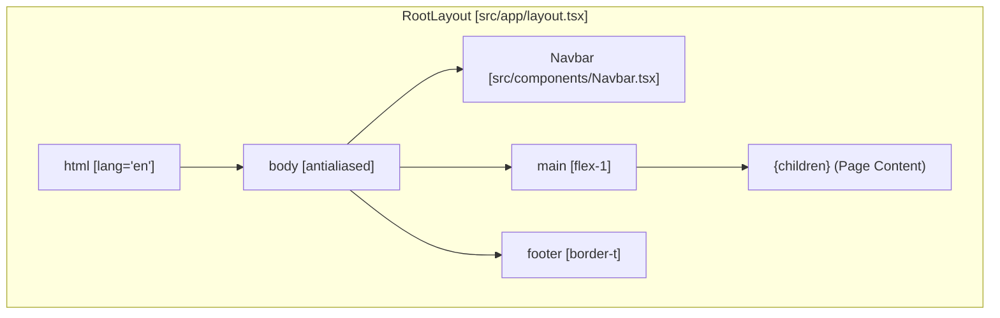
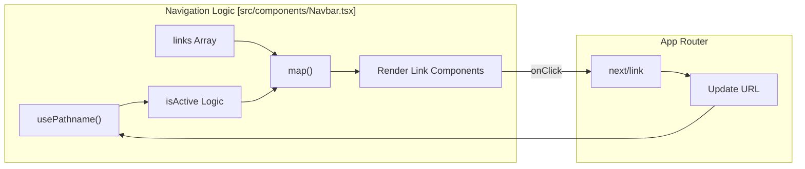

# Application Layout & Navigation

Relevant source files

The following files were used as context for generating this wiki page:

- [src/app/globals.css](src/app/globals.css)
- [src/app/layout.tsx](src/app/layout.tsx)
- [src/components/Navbar.tsx](src/components/Navbar.tsx)

This section details the foundational UI structure of the Animeverse application. It covers the global layout configuration, the styling architecture using Tailwind CSS and Geist fonts, and the navigation system that facilitates movement between the library, discovery, and management modules.

## Root Layout Structure

The application follows the Next.js App Router convention using a single `RootLayout` defined in `src/app/layout.tsx`. This component serves as the entry point for all pages, establishing the global HTML structure and common UI elements like the `Navbar` and `footer`.

### Implementation Details
- **Font Setup**: The application utilizes `Geist` and `Geist_Mono` fonts from `next/font/google`. These are configured as CSS variables (`--font-geist-sans` and `--font-geist-mono`) and applied to the `body` tag [src/app/layout.tsx:6-14]().
- **Global Metadata**: The `metadata` object defines the site title and description used for SEO and browser tab labeling [src/app/layout.tsx:16-19]().
- **Layout Composition**: The `RootLayout` wraps the `{children}` prop within a `<main>` element, ensuring that the `Navbar` remains at the top and the `footer` at the bottom across all routes [src/app/layout.tsx:32-38]().

### Layout Component Hierarchy
The following diagram illustrates how the `RootLayout` organizes the core UI components.

**Layout Component Structure**

**Sources:** [src/app/layout.tsx:21-42](), [src/components/Navbar.tsx:6-53]()

---

## Global Styling & Theme

Styling is handled via Tailwind CSS with a custom theme defined in `src/app/globals.css`. The application uses a "dark-mode-first" aesthetic characterized by glassmorphism and neon accents.

### CSS Variables & Theme
The theme is centered around a specific color palette defined in the `:root` [src/app/globals.css:3-11]():
- **Background**: `#060913` (Deep Navy)
- **Accent**: `#00e5ff` (Cyan)
- **Accent Light**: `#8b5cf6` (Purple)

### Utility Classes
The application defines several specialized CSS classes for its signature look:
- **Glassmorphism**: `.glass-panel` and `.glass-card` use `backdrop-filter: blur()` and semi-transparent borders to create depth [src/app/globals.css:37-50]().
- **Interactive Elements**: `.glow-btn` uses a linear gradient and box-shadow transitions to create a "glowing" effect on hover [src/app/globals.css:58-69]().

**Sources:** [src/app/globals.css:1-85]()

---

## Navigation System

The `Navbar` component provides the primary navigation interface. It is a Client Component located in `src/components/Navbar.tsx`.

### Navigation Links
The system defines a static array of `links` that map routes to labels and icons [src/components/Navbar.tsx:9-15]():

| Label | Route | Icon | Purpose |
| :--- | :--- | :--- | :--- |
| Library | `/` | 📚 | Personal anime collection index |
| Dashboard | `/dashboard` | 📊 | User statistics and activity |
| Discover | `/discover` | 🔍 | Public Jikan API anime search |
| Organize | `/organize` | 🏷️ | Tag management and library addition |
| News | `/news` | 📰 | Sequential news feed from Jikan API |

### Implementation Logic
- **Active State Detection**: The component uses `usePathname()` from `next/navigation` to determine the current route. A link is considered "active" if the current path matches the `href` exactly or starts with the `href` (for sub-pages) [src/components/Navbar.tsx:33]().
- **Visual Feedback**: Active links are styled with a unique border and background (`bg-accent/5 border-accent/15`), while inactive links use subtle hover effects [src/components/Navbar.tsx:39-41]().
- **Sticky Positioning**: The navbar uses `sticky top-0` and `backdrop-blur-md` to remain accessible while scrolling through long anime lists [src/components/Navbar.tsx:18]().

### Navigation Data Flow
This diagram shows how the `Navbar` interacts with the Next.js router to manage state.

**Navbar State & Routing**

**Sources:** [src/components/Navbar.tsx:1-53]()

---

## Footer & Attribution

The footer is defined directly within the `RootLayout`. It provides a permanent attribution to the **Jikan API**, which serves as the primary data source for anime metadata and news [src/app/layout.tsx:36-38]().

- **Dynamic Year**: Uses `new Date().getFullYear()` for the copyright notice.
- **Styling**: Uses `bg-slate-950/40` with a top border to separate it from the main content [src/app/layout.tsx:36]().

**Sources:** [src/app/layout.tsx:36-38]()

---
