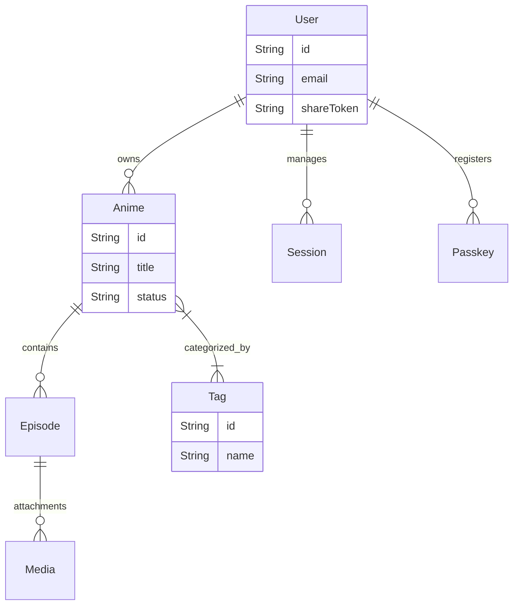

# Data Layer — Database & Schema

<details>
<summary>Relevant source files</summary>

The following files were used as context for generating this wiki page:

- [prisma/schema.prisma](prisma/schema.prisma)
- [src/app/anime/new/page.tsx](src/app/anime/new/page.tsx)
- [src/lib/db.ts](src/lib/db.ts)

</details>


This section provides a high-level overview of the persistence strategy for the Animeverse application. The system utilizes **PostgreSQL** as the primary relational database, managed through the **Prisma ORM**. The data layer is designed to support multi-tenant user libraries, detailed episode journaling, and a flexible tagging system.

## Persistence Strategy

The application employs a centralized database access pattern to ensure efficient connection management. It uses the `PrismaClient` to interface with the PostgreSQL instance defined in the environment configuration [prisma/schema.prisma:8-11]().

### The Prisma Singleton Pattern

To prevent exhausting database connection limits during Next.js hot-reloading in development, the application implements a singleton pattern for the `PrismaClient`. This ensures that a single instance of the client is cached on the `globalThis` object and reused across the application lifecycle [src/lib/db.ts:1-8]().

### Code-to-Database Mapping
The following diagram illustrates how application logic interacts with the database via the `PrismaClient` instance.

**Data Access Architecture**
```mermaid
graph LR
    subgraph "Application Layer"
        [API_Routes] --> [src/lib/db.ts]
        [Server_Components] --> [src/lib/db.ts]
    end

    subgraph "Data Access Layer"
        [src/lib/db.ts] -- "exports" --> ["db (PrismaClient)"]
        ["db (PrismaClient)"] -- "Generates SQL" --> [PostgreSQL_DB]
    end

    subgraph "Schema Definition"
        [prisma/schema.prisma] -- "prisma generate" --> ["db (PrismaClient)"]
    end
```
Sources: [src/lib/db.ts:1-8](), [prisma/schema.prisma:4-6]()

---

## Schema Overview

The database schema is structured around the `User` model, which serves as the root for all personalized content. The schema supports complex relationships, including many-to-many associations between anime entries and tags, and hierarchical relationships between anime, episodes, and media attachments.

### Core Entities
The system is composed of several primary models:
*   **Identity & Access**: `User`, `Session`, and `Passkey` handle authentication and WebAuthn credentials [prisma/schema.prisma:13-43]().
*   **Library Content**: `Anime` and `Episode` store the core metadata and journaling entries [prisma/schema.prisma:45-71]().
*   **Categorization**: `Tag` allows for cross-anime organization using a many-to-many relationship [prisma/schema.prisma:84-89]().
*   **Attachments**: `Media` stores URLs for images or clips associated with specific episodes [prisma/schema.prisma:73-82]().

**Entity Relationship Overview**

Sources: [prisma/schema.prisma:13-90]()

For a deep dive into specific field types, constraints, and cascade delete behaviors, see **[Prisma Schema — Models & Relationships](#2.1)**.

---

## Database Migrations

Database evolution is managed using Prisma Migrate. The workflow ensures that the PostgreSQL schema stays in sync with the `schema.prisma` definition. All changes are tracked in SQL migration files, starting with the initial baseline migration that establishes the core tables and relationships.

Key aspects of the migration strategy include:
*   **Version Control**: Migrations are stored as SQL files in the `prisma/migrations` directory.
*   **Deployment**: The `prisma migrate deploy` command is used in production environments to apply pending changes.
*   **Local Development**: Developers use `prisma db push` for rapid prototyping or `prisma migrate dev` for tracked changes.

For details on the migration history and how to execute schema updates, see **[Database Migrations](#2.2)**.

---

## Child Pages

*   **[Prisma Schema — Models & Relationships](#2.1)**: Detailed documentation of every model, field, and relationship constraint.
*   **[Database Migrations](#2.2)**: Guide to the migration workflow and the SQL initialization history.

---
