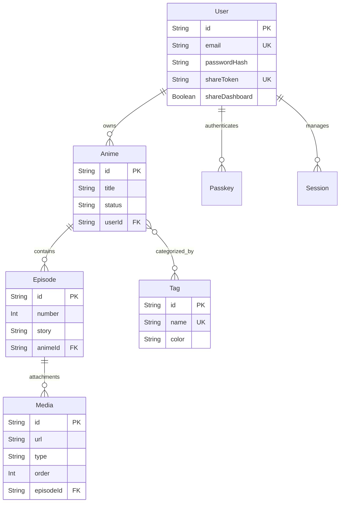
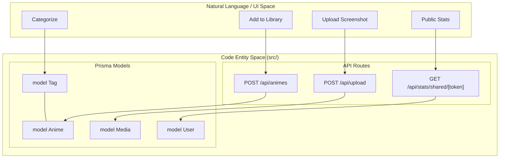

# Prisma Schema — Models & Relationships

Relevant source files

The following files were used as context for generating this wiki page:

- [prisma/schema.prisma](prisma/schema.prisma)
- [src/app/anime/new/page.tsx](src/app/anime/new/page.tsx)
- [src/lib/db.ts](src/lib/db.ts)

This section provides a technical deep dive into the persistence layer of the Animeverse application. The system utilizes **Prisma ORM** with a **PostgreSQL** provider [prisma/schema.prisma:8-11](). The schema is designed to support multi-tenancy, complex media relationships, and flexible categorization through a many-to-many tagging system.

## Database Architecture Overview

The database is accessed via a singleton `PrismaClient` instance to prevent connection exhaustion during Next.js hot reloads [src/lib/db.ts:3-7](). The schema defines seven primary models that handle authentication, user profiles, anime metadata, and rich media content.

### Entity Relationship Diagram

The following diagram illustrates the logical connections between the core database entities.

**Diagram: Animeverse Data Model Relationships**

**Sources:** [prisma/schema.prisma:13-89]()

---

## Core Models

### User & Authentication Models
The `User` model serves as the central authority for data ownership. Most models include a `userId` or are children of models that do, ensuring strict data isolation between users.

*   **User**: Stores account credentials, OTP state for magic links, and dashboard sharing preferences [prisma/schema.prisma:13-26]().
*   **Passkey**: Stores WebAuthn credentials including the `publicKey` and `counter` for secure, passwordless logins [prisma/schema.prisma:28-35]().
*   **Session**: Tracks active user sessions via a unique `token`. It includes an `expiresAt` field for lifecycle management [prisma/schema.prisma:37-43]().

### Content Models
The library's core data is structured hierarchically from Anime down to individual Media files.

#### Anime
The `Anime` model represents a series in a user's library.
*   **Fields**: Includes `title`, `description`, `coverImage`, and `status` [prisma/schema.prisma:45-57]().
*   **Constraints**: The `status` field defaults to `"watching"` [prisma/schema.prisma:50]().
*   **Relationships**: It has a one-to-many relationship with `Episode` and a many-to-many relationship with `Tag` [prisma/schema.prisma:53-54]().

#### Episode
Represents a specific entry within an anime series.
*   **Fields**: Contains a `number`, `title`, and a `story` field intended for long-form text [prisma/schema.prisma:59-63]().
*   **Constraints**: A unique constraint `@@unique([animeId, number])` ensures that an anime cannot have duplicate episode numbers [prisma/schema.prisma:70]().

#### Media
Handles file attachments for episodes (e.g., screenshots or clips).
*   **Fields**: Stores a `url`, a `type` (constrained by application logic to `"image"` or `"clip"`), and an `order` integer for gallery sequencing [prisma/schema.prisma:73-82]().

**Sources:** [prisma/schema.prisma:13-82]()

---

## Relationships & Integrity

### Cascade Deletes
The schema heavily utilizes `onDelete: Cascade` to maintain referential integrity. When a parent entity is removed, all associated child records are automatically purged by the database:
*   Deleting a **User** removes their **Animes**, **Passkeys**, and **Sessions** [prisma/schema.prisma:34,41,56]().
*   Deleting an **Anime** removes all its **Episodes** [prisma/schema.prisma:65]().
*   Deleting an **Episode** removes all associated **Media** records [prisma/schema.prisma:80]().

### Many-to-Many: Anime to Tag
The relationship between `Anime` and `Tag` is a many-to-many relation defined by the name `"AnimeToTag"` [prisma/schema.prisma:54,88]().
*   **Implementation**: Prisma manages an implicit join table under the hood to link these entities.
*   **Usage**: In the UI, tags are fetched via `/api/tags` and associated during anime creation by passing an array of `tagIds` to the backend [src/app/anime/new/page.tsx:71-80]().

---

## Data Flow: From Code to Database

The following diagram bridges the application components to the underlying Prisma models, illustrating how high-level operations interact with specific database entities.

**Diagram: Application Logic to Prisma Entity Mapping**

**Sources:** [prisma/schema.prisma:13-89](), [src/app/anime/new/page.tsx:41-85](), [src/lib/db.ts:1-7]()

### Field Specifications Table

| Model | Field | Type | Attributes | Description |
| :--- | :--- | :--- | :--- | :--- |
| **User** | `shareToken` | `String` | `@unique`, `@default(cuid())` | Used for public dashboard URLs. |
| **Anime** | `status` | `String` | `@default("watching")` | Tracks progress (watching, completed, etc). |
| **Episode** | `story` | `String` | | Supports long-form markdown or text content. |
| **Media** | `type` | `String` | | Distinguishes between images and video clips. |
| **Tag** | `color` | `String` | `@default("#6366f1")` | Hex code for UI rendering. |

**Sources:** [prisma/schema.prisma:13-89]()

---
