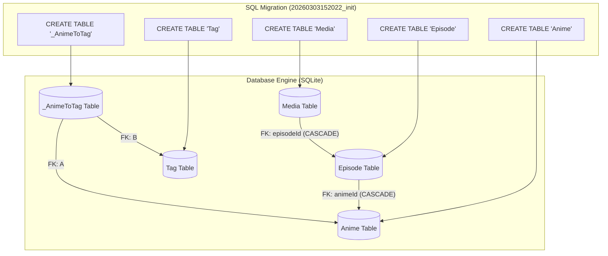
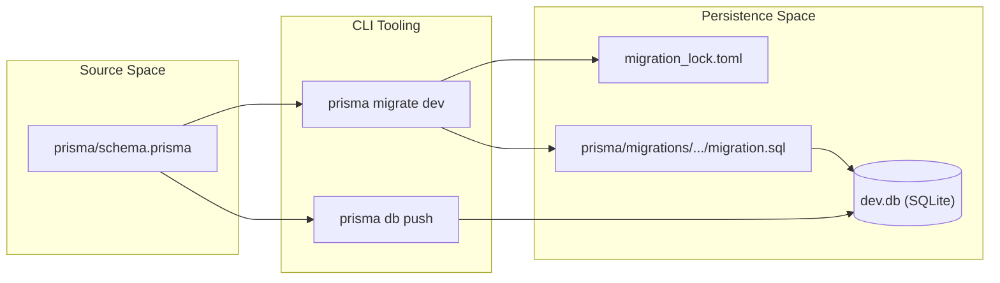

# Database Migrations

Relevant source files

The following files were used as context for generating this wiki page:

- [prisma.config.ts](prisma.config.ts)
- [prisma/migrations/20260303152022_init/migration.sql](prisma/migrations/20260303152022_init/migration.sql)
- [prisma/migrations/migration_lock.toml](prisma/migrations/migration_lock.toml)

This page details the Prisma migration workflow used to manage the Animeverse database schema. It covers the configuration, the initial migration history, and the commands required to synchronize the database state with the application models.

## Migration Configuration

The migration system is configured via `prisma.config.ts`. This file defines the location of the schema, the migration history directory, and the datasource connection string.

| Configuration Key | Value | Description |
| :--- | :--- | :--- |
| `schema` | `prisma/schema.prisma` | The source of truth for the data model. |
| `migrations.path` | `prisma/migrations` | The directory where SQL migration files are stored. |
| `datasource.url` | `process.env.DATABASE_URL` | The connection string (defaults to `file:./dev.db` for local SQLite development). |

The project uses the "classic" engine for migration execution [prisma.config.ts:12-12]().

**Sources:**
- [prisma.config.ts:7-16]()

## Migration Workflow

The project utilizes a standard Prisma migration lifecycle to ensure schema consistency across environments.

### 1. Development (prisma migrate dev)
During development, developers modify `prisma/schema.prisma`. Running `npx prisma migrate dev` performs the following:
1. Generates a new SQL migration file in `prisma/migrations`.
2. Updates the `migration_lock.toml` to track the provider (currently set to `sqlite`) [prisma/migrations/migration_lock.toml:3-3]().
3. Applies the SQL to the local database.
4. Triggers the generation of the Prisma Client.

### 2. Deployment (prisma migrate deploy)
In production or staging environments, `npx prisma migrate deploy` is used. This command:
1. Reads the migration files in `prisma/migrations`.
2. Compares them against the `_prisma_migrations` table in the database.
3. Executes any pending SQL files in chronological order without resetting the database.

### 3. Prototyping (prisma db push)
For rapid prototyping where a formal migration history is not yet required, `npx prisma db push` synchronizes the database schema directly with the Prisma schema file, bypassing the `prisma/migrations` folder.

## Initial Migration: 20260303152022_init

The baseline for the database is defined in the `20260303152022_init` migration. This SQL script establishes the core tables, indexes, and foreign key constraints required for the application.

### Table Definitions and Constraints
The initial migration creates the foundational entities for the library system:

*   **Anime**: Stores core series information with a default status of `watching` [prisma/migrations/20260303152022_init/migration.sql:2-10]().
*   **Episode**: Linked to `Anime` via `animeId`. It includes a composite unique index on `("animeId", "number")` to prevent duplicate episode numbers within a single series [prisma/migrations/20260303152022_init/migration.sql:13-22, 52-52]().
*   **Media**: Stores attachments for episodes. It uses `ON DELETE CASCADE` on the `episodeId` foreign key, ensuring that deleting an episode automatically removes its associated media [prisma/migrations/20260303152022_init/migration.sql:25-34]().
*   **Tag**: Stores unique category names [prisma/migrations/20260303152022_init/migration.sql:37-41, 55-55]().
*   **_AnimeToTag**: A join table facilitating the many-to-many relationship between `Anime` and `Tag` [prisma/migrations/20260303152022_init/migration.sql:44-49]().

### Entity Relationship Mapping
The following diagram maps the SQL migration structures to the application's logical data flow.

**Migration Logic to Database Entities**

**Sources:**
- [prisma/migrations/20260303152022_init/migration.sql:1-62]()

## Migration State Management

The migration state is protected by two primary mechanisms:

1.  **migration_lock.toml**: This file locks the schema to a specific provider (`sqlite`) to prevent accidental migrations against incompatible database types [prisma/migrations/migration_lock.toml:1-4]().
2.  **Shadow Database**: During `migrate dev`, Prisma creates a temporary shadow database to detect schema drifts and validate new migrations before applying them to the main development database.

**Data Flow: Schema to Database**

**Sources:**
- [prisma/migrations/migration_lock.toml:1-4]()
- [prisma.config.ts:7-16]()

---
