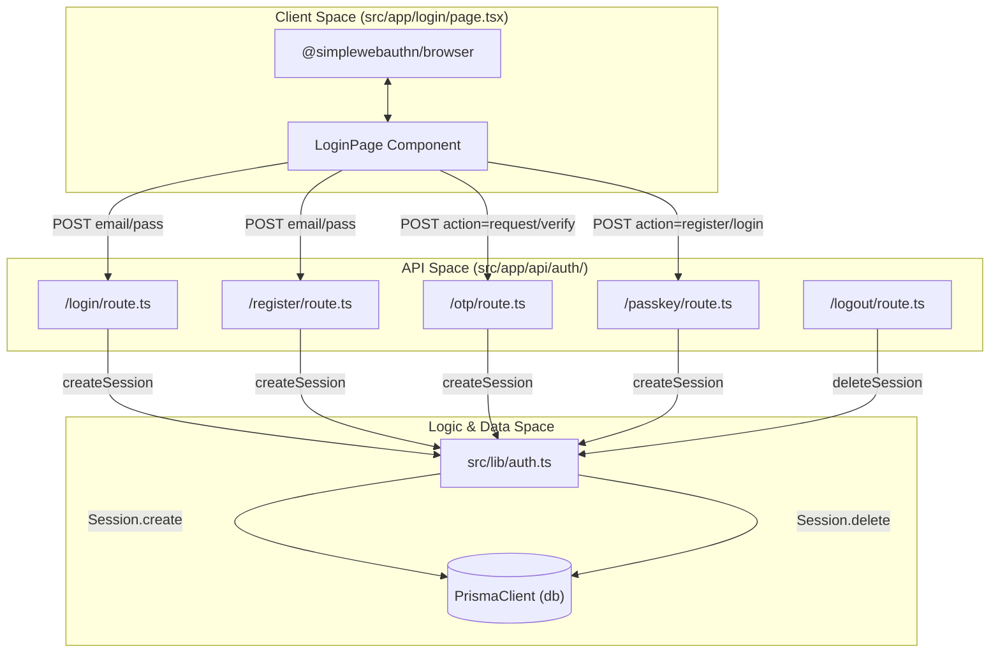
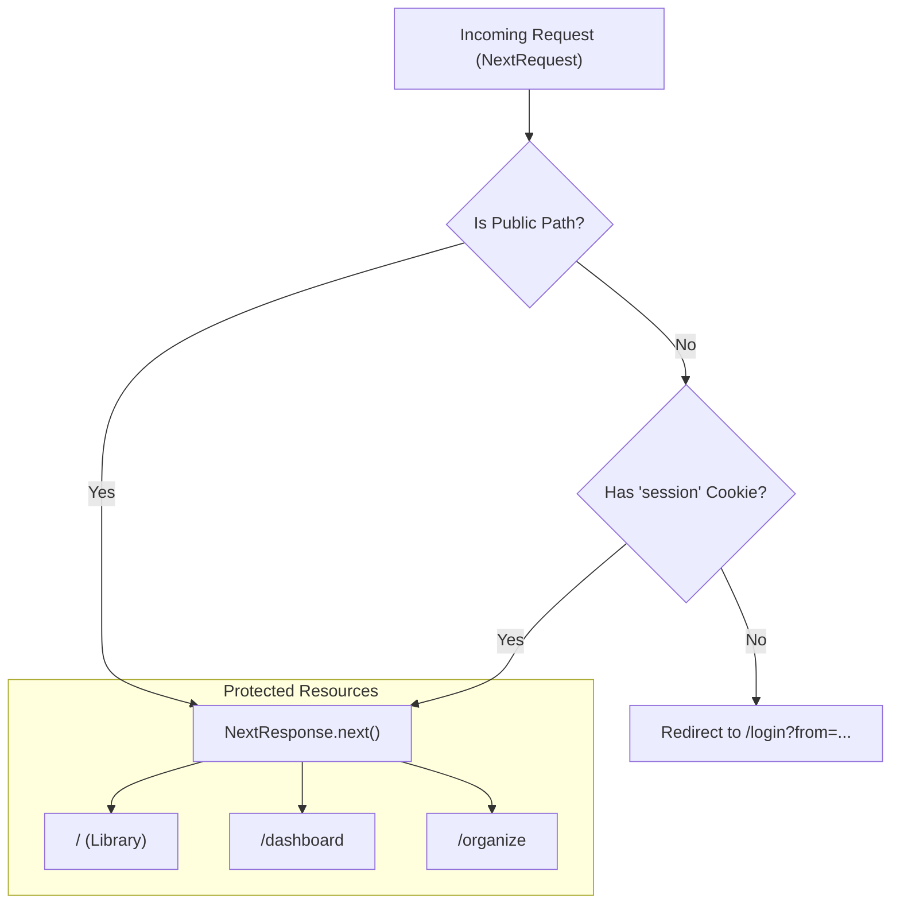

# Authentication System

Relevant source files

The following files were used as context for generating this wiki page:

- [src/app/api/auth/login/route.ts](src/app/api/auth/login/route.ts)
- [src/app/api/auth/logout/route.ts](src/app/api/auth/logout/route.ts)
- [src/app/login/page.tsx](src/app/login/page.tsx)
- [src/lib/auth.ts](src/lib/auth.ts)
- [src/middleware.ts](src/middleware.ts)

The Animeverse platform implements a multi-modal authentication system designed for both security and user convenience. It supports traditional email/password credentials, passwordless Magic Links (OTP), and modern WebAuthn Passkeys. The system is governed by a unified session management layer and a global middleware route guard.

### Authentication Modalities

The system provides four primary entry points for user identity management:

1.  **Email & Password**: Standard registration and login using PBKDF2 hashing with unique salts [src/app/api/auth/login/route.ts:6-8]().
2.  **OTP (Magic Link)**: A passwordless flow where users receive a code via email to authenticate [src/app/login/page.tsx:84-103]().
3.  **WebAuthn Passkeys**: Hardware-bound or biometric authentication using the FIDO2 standard [src/app/login/page.tsx:127-188]().
4.  **Session Management**: A database-backed session store that issues `httpOnly` cookies for persistent access [src/lib/auth.ts:44-58]().

### System Architecture Overview

The following diagram illustrates the relationship between the frontend login interface, the various authentication API routes, and the underlying persistence layer.

**Auth Flow & Code Entities**

Sources: [src/app/login/page.tsx:13-25](), [src/lib/auth.ts:1-70](), [src/app/api/auth/login/route.ts:10-50](), [src/app/api/auth/logout/route.ts:4-25]()

### Route Protection and Middleware

Authentication is enforced at the edge using Next.js Middleware. The system operates on a "secure by default" principle where routes are protected unless explicitly whitelisted in the `PUBLIC_PATHS` or `PUBLIC_API_PREFIXES` arrays [src/middleware.ts:4-14]().

**Middleware Logic Flow**

Sources: [src/middleware.ts:16-52]()

### Session Lifecycle

Sessions are managed through a combination of database records in the `Session` model and a client-side `httpOnly` cookie. 

*   **Creation**: Upon successful authentication (via any method), `createSession(userId)` is called to generate a 32-byte hex token [src/lib/auth.ts:44-45]().
*   **Storage**: The token is stored in the database with a 30-day expiration and sent to the client as a secure cookie [src/app/api/auth/login/route.ts:35-43]().
*   **Validation**: The `getCurrentUser` helper retrieves the session from the database and validates the `expiresAt` timestamp [src/lib/auth.ts:13-41]().
*   **Termination**: The `/api/auth/logout` route deletes the session from the database and clears the client cookie [src/app/api/auth/logout/route.ts:4-18]().

### Sub-System Details

For in-depth technical documentation on specific authentication methods, refer to the following child pages:

*   **[Email/Password & OTP Authentication](#3.1)**: Details on the registration flow, PBKDF2 hashing, and the two-step OTP request/verify cycle.
*   **[WebAuthn Passkey Authentication](#3.2)**: Technical details on the WebAuthn ceremony, challenge management, and integration with `@simplewebauthn`.
*   **[Session Management & Middleware Route Guard](#3.3)**: Deep dive into the `Session` model, the middleware edge-runtime logic, and the `getCurrentUser` utility.

Sources: [src/lib/auth.ts:1-70](), [src/middleware.ts:1-58](), [src/app/api/auth/login/route.ts:1-50](), [src/app/api/auth/logout/route.ts:1-33]()

---
