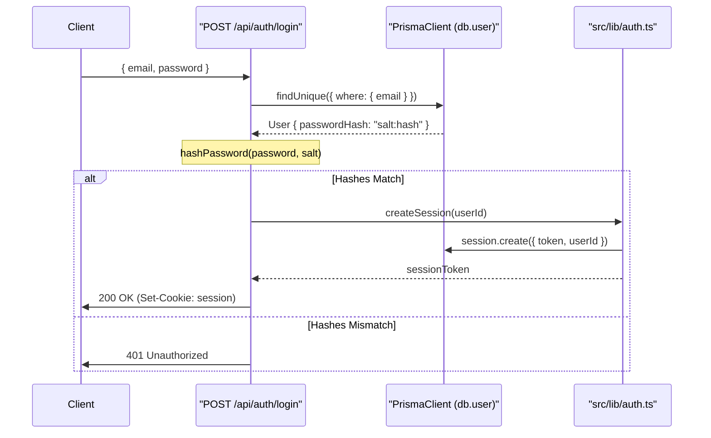
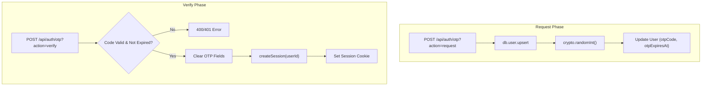

# Email/Password & OTP Authentication

Relevant source files

The following files were used as context for generating this wiki page:

- [src/app/api/auth/login/route.ts](src/app/api/auth/login/route.ts)
- [src/app/api/auth/otp/route.ts](src/app/api/auth/otp/route.ts)
- [src/app/api/auth/passkey/route.ts](src/app/api/auth/passkey/route.ts)
- [src/app/api/auth/register/route.ts](src/app/api/auth/register/route.ts)
- [src/lib/auth.ts](src/lib/auth.ts)

This page details the implementation of the primary authentication methods in Animeverse: traditional email/password credentials and One-Time Password (OTP) magic links. These systems manage user identity, secure credential storage using PBKDF2 hashing, and session lifecycle management.

## Password-Based Authentication

The password-based flow provides a standard registration and login mechanism. It utilizes a salted hashing strategy to ensure that plain-text passwords are never stored in the database.

### Registration Flow
When a user registers via `POST /api/auth/register`, the system performs the following steps:
1. **Normalization**: The email is converted to lowercase and trimmed [src/app/api/api/auth/register/route.ts:18-18]().
2. **Duplicate Check**: The system queries the `db.user` table to ensure the email is not already in use [src/app/api/api/auth/register/route.ts:21-23]().
3. **Hashing**: A 16-byte salt is generated. The password is then hashed using `crypto.pbkdf2Sync` with 1000 iterations, a length of 64 bytes, and the `sha256` algorithm [src/app/api/api/auth/register/route.ts:6-8,29-29]().
4. **Storage**: The `passwordHash` field in the database stores the combined string in the format `salt:hash` [src/app/api/api/auth/register/route.ts:30-30]().

### Login Flow
During `POST /api/auth/login`, the system:
1. Retrieves the user by email [src/app/api/api/auth/login/route.ts:20-22]().
2. Splits the stored `passwordHash` by the `:` delimiter to extract the original salt and hash [src/app/api/api/auth/login/route.ts:28-28]().
3. Re-hashes the provided password attempt with the extracted salt and compares it to the stored hash [src/app/api/api/auth/login/route.ts:29-31]().

**Password Authentication Logic**

**Sources:** [src/app/api/auth/register/route.ts:6-49](), [src/app/api/auth/login/route.ts:10-45](), [src/lib/auth.ts:44-58]()

---

## One-Time Password (OTP) Authentication

The OTP system allows for passwordless sign-in. It is handled by a single route, `POST /api/auth/otp`, which uses a `action` query parameter to distinguish between requesting a code and verifying one.

### OTP Request (`action=request`)
1. **User Discovery/Creation**: If a user with the provided email does not exist, a new user record is created automatically [src/app/api/auth/otp/route.ts:24-26]().
2. **Code Generation**: A 6-digit numeric code is generated using `crypto.randomInt(100000, 999999)` [src/app/api/auth/otp/route.ts:29-29]().
3. **Expiration**: An expiry timestamp is set for 10 minutes in the future [src/app/api/auth/otp/route.ts:30-30]().
4. **Delivery**: In development mode, the code is logged to the server console. In production, it is designed to be integrated with an email provider [src/app/api/auth/otp/route.ts:38-43]().

### OTP Verification (`action=verify`)
1. **Validation**: The system checks if an OTP was requested and if the current time is before `otpExpiresAt` [src/app/api/auth/otp/route.ts:57-63]().
2. **Cleanup**: Upon successful verification, the `otpCode` and `otpExpiresAt` fields are nulled to prevent reuse [src/app/api/auth/otp/route.ts:70-73]().
3. **Session**: A standard session is established via `createSession` [src/app/api/auth/otp/route.ts:75-75]().

**OTP Data Flow**

**Sources:** [src/app/api/auth/otp/route.ts:8-88](), [src/lib/auth.ts:44-58]()

---

## Session Establishment

Regardless of the authentication method (Password or OTP), a successful login results in a session creation.

### The `createSession` Helper
Defined in `src/lib/auth.ts`, this function:
- Generates a 32-byte hex token using `crypto.randomBytes(32)` [src/lib/auth.ts:45-45]().
- Sets an expiration date 30 days in the future [src/lib/auth.ts:47-47]().
- Persists the token in the `db.session` table [src/lib/auth.ts:49-55]().

### Session Cookie Configuration
The API routes return the session token to the client using a `Set-Cookie` header with the following security attributes:
| Attribute | Value | Purpose |
| :--- | :--- | :--- |
| `httpOnly` | `true` | Prevents client-side JavaScript from accessing the token [src/app/api/auth/login/route.ts:39-39](). |
| `secure` | `process.env.NODE_ENV === "production"` | Ensures the cookie is only sent over HTTPS in production [src/app/api/auth/login/route.ts:40-40](). |
| `maxAge` | `2592000` (30 days) | Matches the database session expiration [src/app/api/auth/login/route.ts:41-41](). |
| `path` | `/` | Makes the session available across the entire application [src/app/api/auth/login/route.ts:42-42](). |

**Sources:** [src/lib/auth.ts:44-58](), [src/app/api/auth/login/route.ts:38-43]()

---
