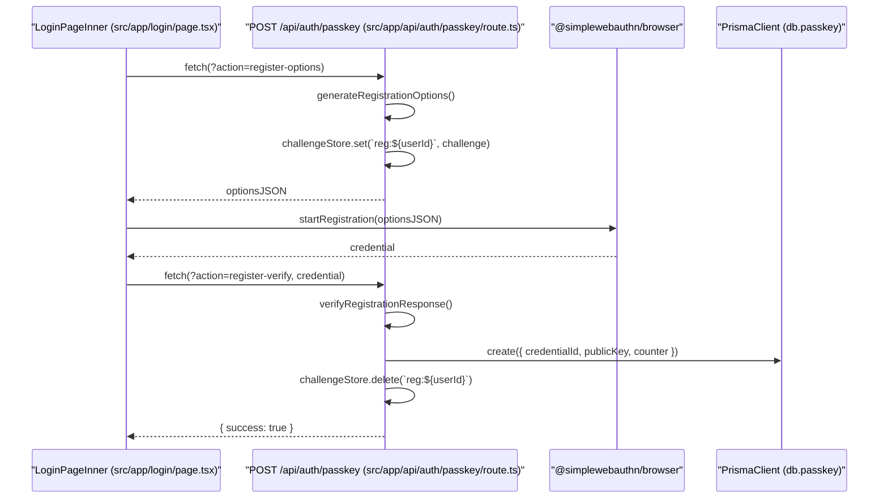
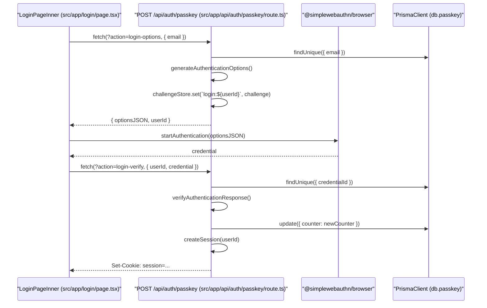

# WebAuthn Passkey Authentication

Relevant source files

The following files were used as context for generating this wiki page:

- [src/app/api/auth/passkey/route.ts](src/app/api/auth/passkey/route.ts)
- [src/app/api/auth/register/route.ts](src/app/api/auth/register/route.ts)
- [src/app/login/page.tsx](src/app/login/page.tsx)
- [src/middleware.ts](src/middleware.ts)

This section details the implementation of WebAuthn (Passkeys) within the Animeverse application. The system provides a passwordless authentication alternative using the FIDO2 standard, allowing users to register biometric or hardware security keys.

The implementation utilizes the `@simplewebauthn` suite: `@simplewebauthn/server` for backend challenge generation and verification, and `@simplewebauthn/browser` for client-side interaction with the WebAuthn API.

## System Overview

WebAuthn authentication is split into two distinct ceremonies: **Registration** (binding a new credential to an existing account) and **Authentication** (logging in using a previously registered credential). Both ceremonies follow a two-phase "Options" and "Verify" flow.

### Key Components

| Component | Role |
| :--- | :--- |
| `challengeStore` | An in-memory `Map<string, string>` used to store cryptographic challenges between the options and verify phases [src/app/api/auth/passkey/route.ts:20-20](). |
| `Passkey` Model | Database table storing `credentialId`, `publicKey` (Base64), and the `counter` for replay protection [src/app/api/auth/passkey/route.ts:88-95](). |
| `/api/auth/passkey` | Unified API route handling all WebAuthn actions via the `action` query parameter [src/app/api/auth/passkey/route.ts:22-26](). |

**Sources:** [src/app/api/auth/passkey/route.ts:1-26](), [src/app/api/auth/passkey/route.ts:88-95]()

## Data Flow: Registration Ceremony

Registration requires the user to be already authenticated via another method (e.g., Email/Password). This "bootstraps" the passkey onto the existing `User` account.

### Registration Sequence

The following diagram maps the registration flow from the UI components to the server-side verification logic.

**Passkey Registration Flow**

**Sources:** [src/app/login/page.tsx:127-156](), [src/app/api/auth/passkey/route.ts:33-100]()

## Data Flow: Authentication Ceremony

Authentication allows a user to log in by providing their email. The server looks up registered credentials for that email and issues a challenge.

### Authentication Sequence

This diagram illustrates the login process using an existing passkey.

**Passkey Login Flow**

**Sources:** [src/app/login/page.tsx:159-188](), [src/app/api/auth/passkey/route.ts:103-195]()

## Implementation Details

### Challenge Management
The `challengeStore` is currently implemented as an in-memory `Map` [src/app/api/auth/passkey/route.ts:20-20](). Challenges are prefixed with either `reg:` or `login:` followed by the `userId` to prevent collision and ensure the correct user is completing the ceremony [src/app/api/auth/passkey/route.ts:56-56](), [src/app/api/auth/passkey/route.ts:126-126]().

### Security Configurations
- **RP_ID**: Defined by `NEXT_PUBLIC_RP_ID`, defaults to `localhost` [src/app/api/auth/passkey/route.ts:16-16]().
- **Origin**: Defined by `NEXT_PUBLIC_ORIGIN`, defaults to `http://localhost:3000` [src/app/api/auth/passkey/route.ts:17-17]().
- **Replay Protection**: The `counter` returned by the authenticator is stored in the database [src/app/api/auth/passkey/route.ts:92-92]() and updated on every login [src/app/api/auth/passkey/route.ts:174-174](). If the counter does not increase as expected, the `verifyAuthenticationResponse` function will fail the verification.
- **User Verification**: Set to `preferred` to allow for either PIN/Biometric or simple presence checks depending on the authenticator capability [src/app/api/auth/passkey/route.ts:52-52](), [src/app/api/auth/passkey/route.ts:123-123]().

### API Actions Summary

| Action | Method | Purpose |
| :--- | :--- | :--- |
| `register-options` | `POST` | Generates WebAuthn registration options for the current logged-in user [src/app/api/auth/passkey/route.ts:33-59](). |
| `register-verify` | `POST` | Validates the credential from the browser and saves it to the `Passkey` table [src/app/api/auth/passkey/route.ts:62-100](). |
| `login-options` | `POST` | Fetches allowed credentials for an email and generates an auth challenge [src/app/api/auth/passkey/route.ts:103-129](). |
| `login-verify` | `POST` | Verifies the signed challenge, updates the counter, and creates a session [src/app/api/auth/passkey/route.ts:132-195](). |

**Sources:** [src/app/api/auth/passkey/route.ts:1-202](), [src/app/login/page.tsx:127-188]()

---
