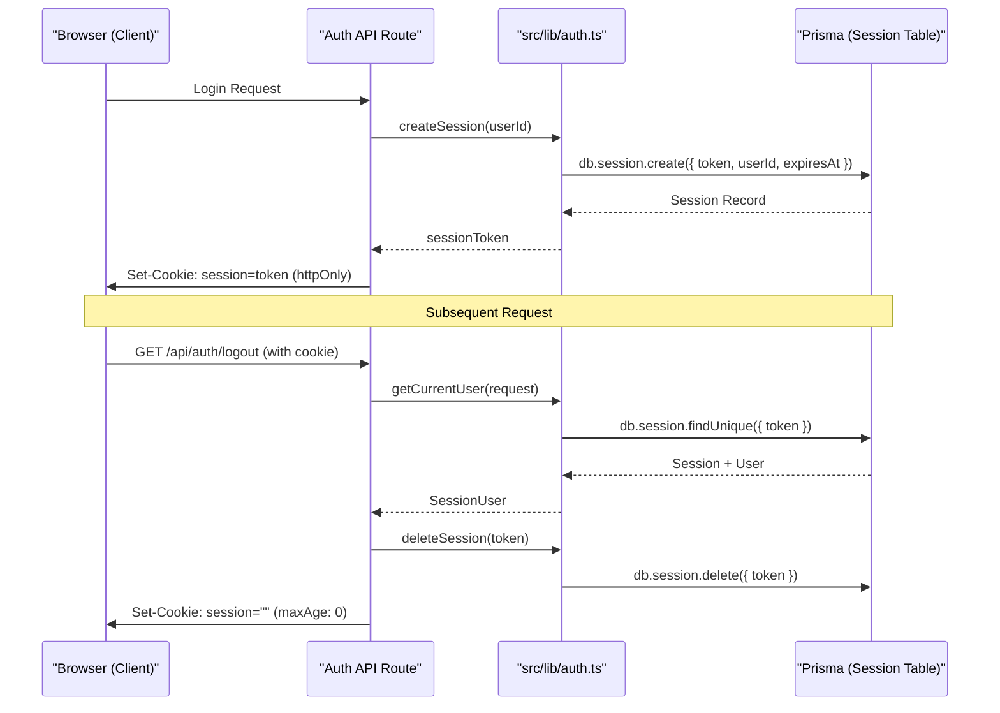
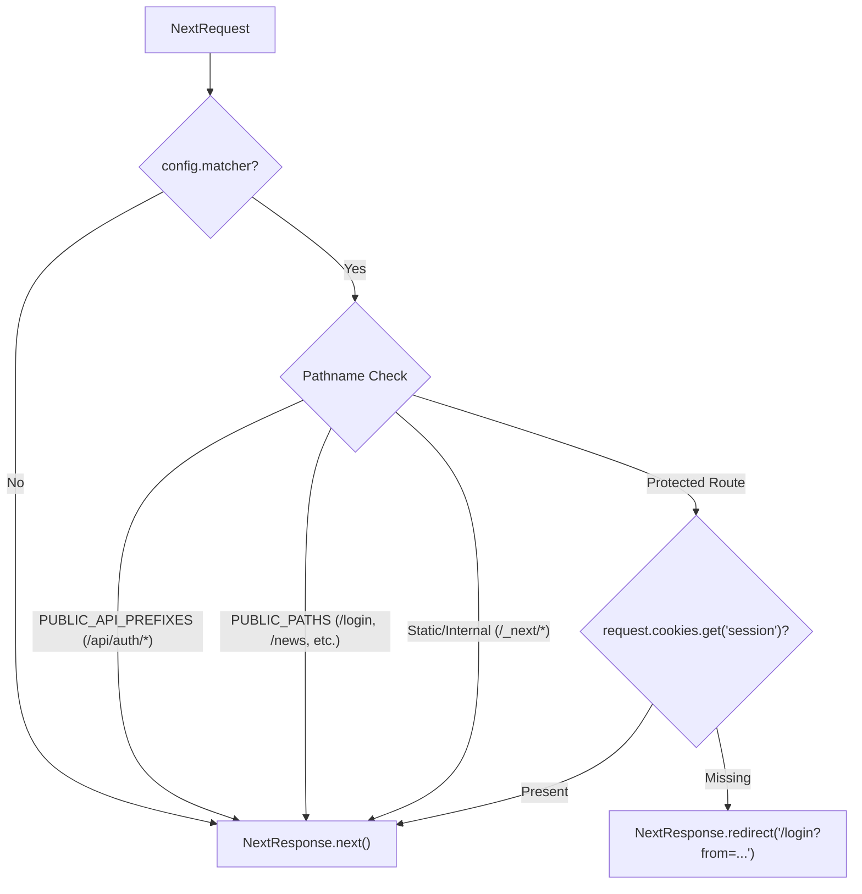

# Session Management & Middleware Route Guard

Relevant source files

The following files were used as context for generating this wiki page:

- [src/app/api/auth/logout/route.ts](src/app/api/auth/logout/route.ts)
- [src/app/login/page.tsx](src/app/login/page.tsx)
- [src/lib/auth.ts](src/lib/auth.ts)
- [src/middleware.ts](src/middleware.ts)

This page details the implementation of session persistence and the global route protection mechanism. The system uses a database-backed session model, `httpOnly` cookies for secure token storage, and a Next.js middleware for edge-side authentication enforcement.

## Session Lifecycle Management

The application manages user sessions through a combination of unique tokens stored in the database and corresponding client-side cookies. 

### Session Creation and Storage
When a user successfully authenticates (via password, OTP, or Passkey), a new session is generated. The `createSession` function generates a cryptographically secure 32-byte hex string as a token [src/lib/auth.ts:44-45](). This token is stored in the `Session` table with a 30-day expiration date [src/lib/auth.ts:46-55]().

### Session Retrieval
To identify the current user during a request, the `getCurrentUser` helper extracts the token from the request cookies [src/lib/auth.ts:15](). It performs a database lookup to find a matching token that has not expired [src/lib/auth.ts:18-34]().

### Session Destruction
Logging out involves both removing the record from the database via `deleteSession` [src/lib/auth.ts:61-69]() and clearing the client-side cookie by setting its `maxAge` to 0 [src/app/api/auth/logout/route.ts:13-18]().

### Session Data Flow
The following diagram illustrates the interaction between the authentication helpers and the database.

**Diagram: Session Lifecycle Flow**

Sources: [src/lib/auth.ts:13-70](), [src/app/api/auth/logout/route.ts:4-33]()

---

## Middleware Route Guard

The `src/middleware.ts` file implements a global route guard that runs on the Next.js Edge Runtime. It determines if a request should be allowed to proceed based on the requested path and the presence of a session cookie.

### Public vs. Protected Routes
The middleware maintains lists of paths that bypass authentication:
- **`PUBLIC_PATHS`**: Routes like `/login`, `/news`, and `/discover` [src/middleware.ts:4-9]().
- **`PUBLIC_API_PREFIXES`**: All endpoints under `/api/auth/` (login, register, etc.) [src/middleware.ts:12-14]().
- **Static Assets**: Paths starting with `/_next/`, `favicon`, or containing a file extension [src/middleware.ts:33-39]().

### Edge-Side Authentication Check
The middleware performs a "lightweight" check by inspecting the `session` cookie [src/middleware.ts:42](). To maintain performance at the edge, it does **not** query the database; it only verifies the existence of the cookie. If the cookie is missing and the path is protected, the user is redirected to `/login`, with the original destination preserved in the `from` query parameter [src/middleware.ts:44-49]().

**Diagram: Middleware Logic Space**

Sources: [src/middleware.ts:1-58]()

---

## Technical Reference: Auth Helpers

The `src/lib/auth.ts` file provides the core logic for managing the `SessionUser` interface and session persistence.

| Function | Input | Output | Description |
| :--- | :--- | :--- | :--- |
| `getCurrentUser` | `NextRequest` | `Promise<SessionUser \| null>` | Validates the session cookie against the DB and returns user details [src/lib/auth.ts:13-41](). |
| `createSession` | `userId: string` | `Promise<string>` | Generates a 32-byte hex token and persists it to the DB [src/lib/auth.ts:44-58](). |
| `deleteSession` | `token: string` | `Promise<void>` | Removes the session record from the DB [src/lib/auth.ts:61-69](). |

### The SessionUser Interface
The `SessionUser` interface defines the user data available to server-side components and API routes after a successful session lookup:
- `id`: The unique user identifier [src/lib/auth.ts:6]().
- `email`: User's email address [src/lib/auth.ts:7]().
- `shareDashboard`: Boolean flag for public dashboard visibility [src/lib/auth.ts:8]().
- `shareToken`: Token used for public dashboard URLs [src/lib/auth.ts:9]().

Sources: [src/lib/auth.ts:5-10](), [src/lib/auth.ts:13-70]()

## Client-Side Session Handling

The `LoginPageInner` component in `src/app/login/page.tsx` handles the initial session establishment.

1. **Auto-Redirect**: On mount, the component calls `/api/auth/logout` (which uses `getCurrentUser` via a `GET` request) to check if a session already exists. If it does, the user is redirected to the home page or the `from` destination [src/app/login/page.tsx:27-34]().
2. **Post-Auth Redirection**: After successful login via any method (Password, OTP, or Passkey), the router pushes the user to the `redirectTo` path [src/app/login/page.tsx:54](), [src/app/login/page.tsx:118](), [src/app/login/page.tsx:182]().

Sources: [src/app/login/page.tsx:13-189](), [src/app/api/auth/logout/route.ts:27-33]()

---
