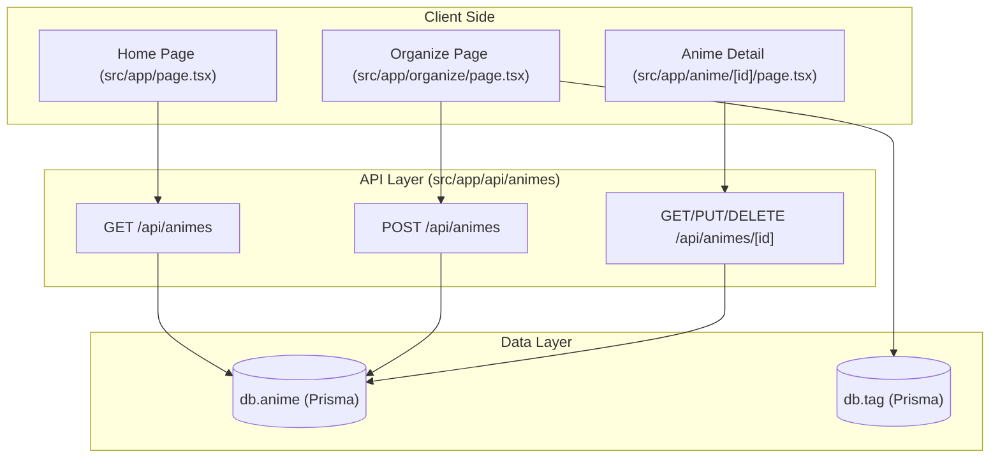
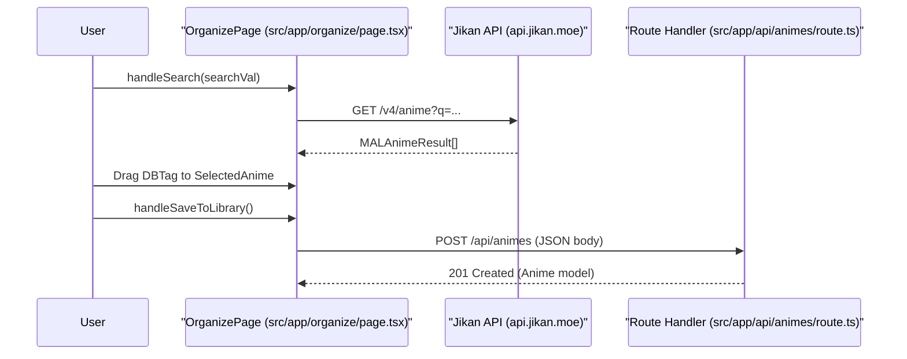

# Anime Library — Core Features

Relevant source files

The following files were used as context for generating this wiki page:

- [src/app/api/animes/[id]/route.ts](src/app/api/animes/[id]/route.ts)
- [src/app/api/animes/route.ts](src/app/api/animes/route.ts)
- [src/app/organize/page.tsx](src/app/organize/page.tsx)
- [src/app/page.tsx](src/app/page.tsx)

The Anime Library is the central management system of the application, providing a comprehensive interface for cataloging, organizing, and tracking personal anime collections. It integrates local user data with global metadata from the Jikan API to streamline the entry creation process while maintaining a strictly multi-tenant environment.

### Data Flow Overview

The library operates through a series of Next.js API routes that interface with the `db.anime` Prisma model. All operations are scoped to the `userId` of the authenticated requester to ensure data isolation.

**High-Level Component Interaction**

Sources: [src/app/api/animes/route.ts:5-94](), [src/app/api/animes/[id]/route.ts:5-106](), [src/app/page.tsx:37-59]()

---

### Library Dashboard (Home Page)
The primary entry point for the library is the dashboard, which provides a searchable and filterable grid of the user's collection. It utilizes debounced searching and real-time filtering by status (e.g., `watching`, `completed`) and custom tags.

For details, see [Library Dashboard (Home Page)](#4.1).

Sources: [src/app/page.tsx:31-42](), [src/app/page.tsx:83-86]()

---

### Anime Detail, Edit & Creation Pages
Users can manage individual entries through dedicated routes. The detail page aggregates metadata, tags, and associated episode journals. The creation and editing flows allow for manual data entry or modification of existing records, including the management of many-to-many relationships with tags via `tagIds`.

For details, see [Anime Detail, Edit & Creation Pages](#4.2).

Sources: [src/app/api/animes/[id]/route.ts:40-80](), [src/app/api/animes/route.ts:62-94]()

---

### Organizer Workspace
The `/organize` page acts as a high-productivity workspace. It combines Jikan API search capabilities with a drag-and-drop interface for tagging. This allows users to find global anime data and "import" it into their local library with pre-assigned custom tags in a single pipeline.

For details, see [Organizer Workspace](#4.3).

**Organizer Pipeline to Code Entity Mapping**

Sources: [src/app/organize/page.tsx:105-119](), [src/app/organize/page.tsx:147-188]()

---

### Anime API Routes
The backend for the library is powered by a RESTful API structure. These routes handle the complex logic of filtering by tag names, sorting by `updatedAt` or `title`, and ensuring that deletions cascade correctly where necessary.

| Method | Endpoint | Description |
|:---|:---|:---|
| `GET` | `/api/animes` | Fetch list with `search`, `tag`, `status`, and `sort` params. |
| `POST` | `/api/animes` | Create new entry with `tagIds` connection. |
| `GET` | `/api/animes/[id]` | Fetch single entry with full `episodes` and `media` relation. |
| `PUT` | `/api/animes/[id]` | Update metadata and reset `tags` using `set` operation. |
| `DELETE` | `/api/animes/[id]` | Remove entry after verifying ownership. |

For details, see [Anime API Routes](#4.4).

Sources: [src/app/api/animes/route.ts:5-60](), [src/app/api/animes/[id]/route.ts:16-27](), [src/app/api/animes/[id]/route.ts:63-73]()

---
