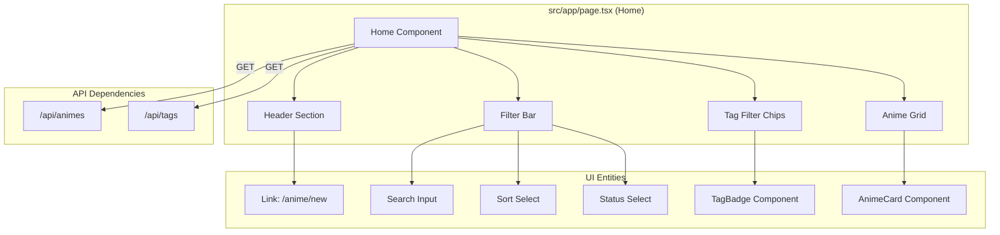

# Library Dashboard (Home Page)

<details>
<summary>Relevant source files</summary>

The following files were used as context for generating this wiki page:

- [src/app/organize/page.tsx](src/app/organize/page.tsx)
- [src/app/page.tsx](src/app/page.tsx)
- [src/components/AnimeCard.tsx](src/components/AnimeCard.tsx)
- [src/components/TagBadge.tsx](src/components/TagBadge.tsx)

</details>


The Library Dashboard serves as the primary entry point for users to browse, filter, and manage their personal anime collection. Located at the root route (`/`), it provides a comprehensive interface for viewing cataloged anime entries with real-time filtering and sorting capabilities.

## Implementation Overview

The dashboard is implemented as a Client Component in `src/app/page.tsx` [src/app/page.tsx:1](). It manages several pieces of local state to handle the display of anime entries and the available tag filters.

### Data Flow and State Management
The page utilizes the `fetchAnimes` function to synchronize the UI with the backend API. This function constructs a query string based on the current filter state and updates the `animes` state variable [src/app/page.tsx:37-59]().

| State Variable | Type | Purpose |
|:---|:---|:---|
| `animes` | `Anime[]` | Stores the list of anime records fetched from `/api/animes` [src/app/page.tsx:29](). |
| `tags` | `Tag[]` | Stores all available tags for the filter chips, fetched from `/api/tags` [src/app/page.tsx:30](). |
| `selectedTag` | `string` | The name of the currently active tag filter [src/app/page.tsx:31](). |
| `statusFilter` | `StatusFilter` | Filters by status: `watching`, `completed`, `dropped`, or `planned` [src/app/page.tsx:32](). |
| `sortBy` | `SortField` | Determines sort order: `updatedAt`, `createdAt`, or `title` [src/app/page.tsx:33](). |
| `search` | `string` | The current search query string [src/app/page.tsx:34](). |

### Debounced Search Logic
To prevent excessive API calls while the user types, the dashboard implements a 300ms debounce timer within a `useEffect` hook [src/app/page.tsx:83-86]().

**Search Execution Flow:**
1. User types into the search input, updating the `search` state [src/app/page.tsx:117]().
2. The `useEffect` hook triggers, clearing any existing timeout [src/app/page.tsx:85]().
3. A new `setTimeout` is created to call `fetchAnimes` after 300ms [src/app/page.tsx:84]().

**Sources:** [src/app/page.tsx:1-87]()

---

## Component Architecture

The dashboard is composed of several functional areas that interact with the application's internal API.

### Dashboard Structure Diagram
This diagram illustrates the relationship between the Home page component and the UI entities it manages.


**Sources:** [src/app/page.tsx:89-200](), [src/components/AnimeCard.tsx:1-40](), [src/components/TagBadge.tsx:1-19]()

---

## Filtering and Sorting

The dashboard provides three primary methods for narrowing down the library view.

### 1. Global Search and Selects
The search input and dropdown selects allow for broad filtering. The `statusFilter` supports the specific enum values defined in the Prisma schema (via the `StatusFilter` type) [src/app/page.tsx:26](). Sorting can be performed by title or timestamps [src/app/page.tsx:25]().

### 2. Tag Filter Chips
The dashboard fetches all tags associated with the user's library from `/api/tags` [src/app/page.tsx:63-81](). These are rendered as `TagBadge` components [src/app/page.tsx:154-163](). 
- Clicking a tag sets `selectedTag` to that tag's name [src/app/page.tsx:160]().
- Clicking the same tag again clears the filter [src/app/page.tsx:160]().
- Each tag badge displays the count of anime associated with it using the `_count.animes` property [src/app/page.tsx:156]().

### 3. API Integration
The `fetchAnimes` function maps these UI states directly to URL search parameters sent to the backend [src/app/page.tsx:38-42]().

**Sources:** [src/app/page.tsx:37-59](), [src/app/page.tsx:109-166]()

---

## Grid Layout and Anime Cards

The library results are displayed in a responsive grid using the `AnimeCard` component.

### Grid Configuration
The grid layout adjusts based on screen size to optimize the use of space [src/app/page.tsx:186-187]():
- **Mobile:** 2 columns
- **Small Screens:** 3 columns
- **Medium Screens:** 4 columns
- **Large Screens:** 5 columns

### AnimeCard Implementation
The `AnimeCard` (`src/components/AnimeCard.tsx`) handles the presentation of individual library entries.
- **Status Badges:** Uses a `statusLabels` map to apply specific Tailwind classes (e.g., `emerald` for watching, `cyan` for completed) based on the `status` string [src/components/AnimeCard.tsx:22-27]().
- **Tag Display:** Displays up to the first 3 tags associated with the anime. If more exist, it shows a "+N" count [src/components/AnimeCard.tsx:75-84]().
- **Episode Count:** Displays the total number of episodes journaled for that entry using the `_count.episodes` aggregate [src/components/AnimeCard.tsx:72-74]().

### Data Entity Association Diagram
The following diagram maps the data fields returned by the API to the visual elements in the `AnimeCard`.

```mermaid
classDiagram
    class "Anime API Object" {
        +String id
        +String title
        +String description
        +String coverImage
        +String status
        +Tag[] tags
        +Object _count
    }

    class "AnimeCard UI" {
        +Link href="/anime/[id]"
        +img src=coverImage
        +span statusLabel
        +h3 title
        +p description
        +p episodeCount
        +TagBadge[] tagChips
    }

    "Anime API Object" --|> "AnimeCard UI" : Maps to
```

**Sources:** [src/app/page.tsx:186-198](), [src/components/AnimeCard.tsx:12-89]()

---
