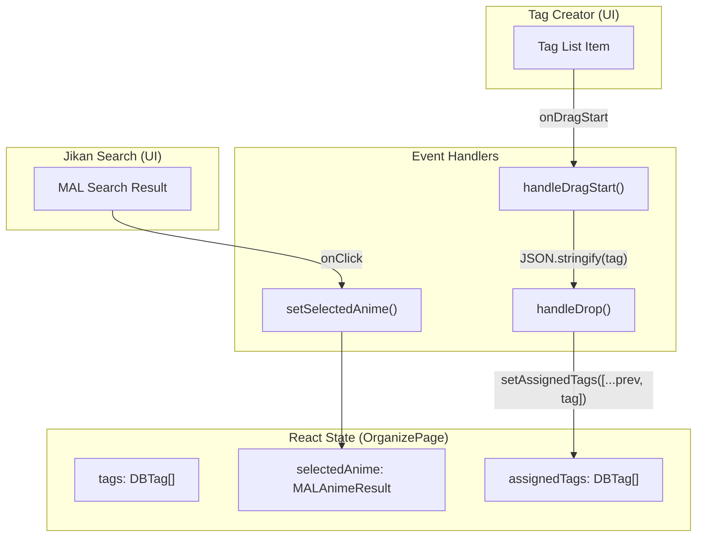
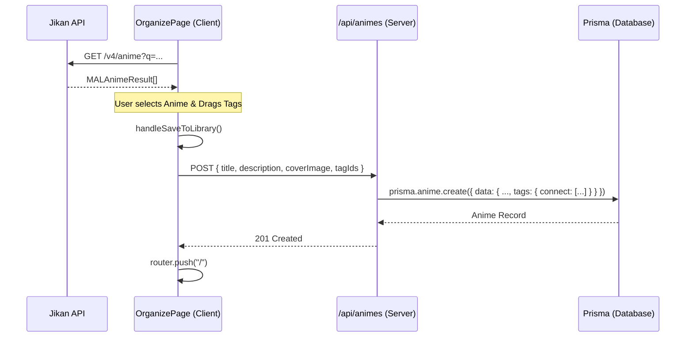

# Organizer Workspace

Relevant source files

The following files were used as context for generating this wiki page:

- [src/app/organize/page.tsx](src/app/organize/page.tsx)
- [src/app/page.tsx](src/app/page.tsx)

The Organizer Workspace is a specialized utility page (`/organize`) designed for high-efficiency library curation. It provides a centralized interface for managing the global Tag pool and importing metadata from the Jikan API (MyAnimeList) via an interactive drag-and-drop canvas. This workspace streamlines the process of categorizing new entries before they are committed to the local database.

## Tag Management (CRUD)

The workspace provides a dedicated "Tag Creator" interface for managing the `Tag` entity pool. This allows users to define custom categories that are later used for filtering on the [Library Dashboard](4.1. Library Dashboard (Home Page)).

### Implementation Details
- **Fetch Logic**: The `fetchTags` function retrieves all tags associated with the current user by calling `GET /api/tags` [src/app/organize/page.tsx:48-62]().
- **Creation**: Tags are created via the `handleCreateTag` function, which POSTs a `name` and `color` to `/api/tags` [src/app/organize/page.tsx:68-91]().
- **Deletion**: The `handleDeleteTag` function targets the specific resource at `DELETE /api/tags/[id]` [src/app/organize/page.tsx:93-103]().

| Feature | Code Entity | API Endpoint |
|:---|:---|:---|
| List Tags | `fetchTags` | `GET /api/tags` |
| Create Tag | `handleCreateTag` | `POST /api/tags` |
| Delete Tag | `handleDeleteTag` | `DELETE /api/tags/[id]` |

**Sources:** [src/app/organize/page.tsx:31-103]()

## Metadata Discovery (Jikan API)

The workspace integrates with the Jikan API to allow users to search for anime metadata without manual data entry.

1.  **Search Input**: Users provide a query string via the `searchVal` state [src/app/organize/page.tsx:37-37]().
2.  **API Call**: The `handleSearch` function executes a fetch request to `https://api.jikan.moe/v4/anime` with a limit of 10 results [src/app/organize/page.tsx:105-119]().
3.  **Selection**: When a result is clicked, it is stored in the `selectedAnime` state, which uses the `MALAnimeResult` interface to map Jikan fields (e.g., `synopsis`, `images.jpg.large_image_url`) to the application's internal structure [src/app/organize/page.tsx:12-26, 40-40]().

**Sources:** [src/app/organize/page.tsx:12-40](), [src/app/organize/page.tsx:105-119]()

## Drag-and-Drop Canvas

The core of the Organizer Workspace is the interactive canvas where `DBTag` objects are assigned to a `selectedAnime`.

### Data Flow and Events
The system utilizes the native HTML5 Drag and Drop API:
- **Drag Start**: The `handleDragStart` function serializes the `DBTag` object into a JSON string and attaches it to the `dataTransfer` object [src/app/organize/page.tsx:122-124]().
- **Drop**: The `handleDrop` function parses the tag data, validates that the tag is not already assigned to the current selection, and updates the `assignedTags` state [src/app/organize/page.tsx:126-141]().
- **Removal**: Users can remove tags from the staging area via `removeAssignedTag`, which filters the `assignedTags` array by ID [src/app/organize/page.tsx:143-145]().

### Visual Representation of Organizer Logic
The following diagram bridges the UI interaction to the React state management:

**Organizer State Interaction**

**Sources:** [src/app/organize/page.tsx:31-46](), [src/app/organize/page.tsx:122-145]()

## Library Persistence Pipeline

Once an anime is selected and tags are assigned, the `handleSaveToLibrary` function orchestrates the persistence of the data to the backend.

### Persistence Sequence
1.  **Validation**: Ensures `selectedAnime` is not null and `assignedTags` contains at least one element [src/app/organize/page.tsx:148-155]().
2.  **Payload Mapping**: Maps the Jikan-specific fields to the internal `Anime` model:
    - `title_english` or `title` becomes the primary title.
    - `synopsis` maps to `description`.
    - `large_image_url` maps to `coverImage`.
    - `tagIds` is populated from the `assignedTags` state.
3.  **POST Request**: Sends the payload to `POST /api/animes` [src/app/organize/page.tsx:159-169]().
4.  **Success Handling**: Upon a successful response, the workspace state is reset, and the user is redirected to the home page using `router.push("/")` [src/app/organize/page.tsx:171-178]().

### Data Pipeline Diagram
The diagram below traces the data from the external API through the workspace and into the local database.

**Import Pipeline Flow**

**Sources:** [src/app/organize/page.tsx:147-188](), [src/app/page.tsx:37-59]()

---
