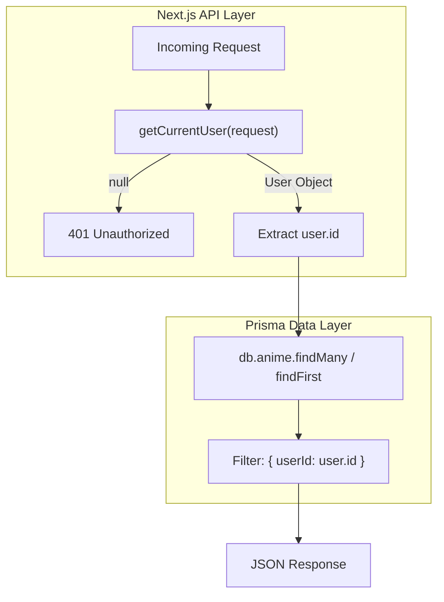
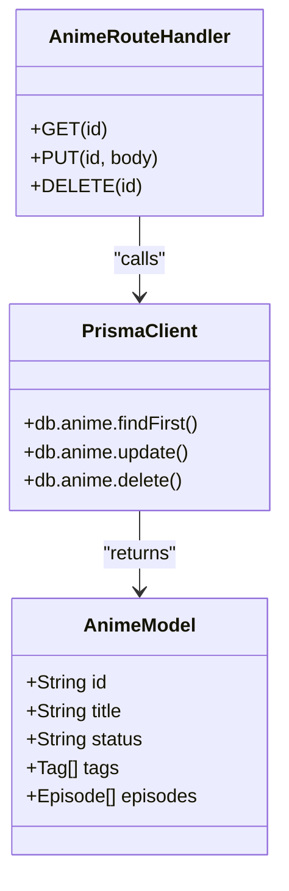

# Anime API Routes

Relevant source files

The following files were used as context for generating this wiki page:

- [src/app/api/animes/[id]/route.ts](src/app/api/animes/[id]/route.ts)
- [src/app/api/animes/route.ts](src/app/api/animes/route.ts)

The Anime API routes provide the backend infrastructure for managing a user's personal anime library. These endpoints handle CRUD (Create, Read, Update, Delete) operations on `Anime` models, ensuring strict multi-tenancy through user session validation. All routes are located within the Next.js App Router directory structure under `/api/animes`.

## Core Authentication & Multi-Tenancy

Every endpoint in the Anime API follows a strict security pattern to ensure data isolation between users. Before processing any request, the handler calls `getCurrentUser(request)` to retrieve the authenticated user's session.

1.  **Identity Verification**: If no user is found, the API returns a `401 Unauthorized` response [src/app/api/animes/route.ts:7-10]().
2.  **Ownership Scoping**: All database queries include a `userId` filter to prevent users from accessing or modifying anime entries belonging to others [src/app/api/animes/[id]/route.ts:17-17]().

### Request Authorization Flow

This diagram illustrates how a request is validated and scoped to a specific `userId`.

**API Request Authorization**

**Sources:**
- [src/app/api/animes/route.ts:7-10]()
- [src/app/api/animes/[id]/route.ts:10-13]()
- [src/lib/auth.ts]() (referenced via `getCurrentUser`)

---

## Library Index: GET /api/animes

The collection endpoint fetches a list of anime entries for the current user. It supports complex filtering and sorting through URL search parameters.

### Filtering and Sorting Parameters

| Parameter | Type | Description |
| :--- | :--- | :--- |
| `tag` | String | Filter by tag name (exact match) [src/app/api/animes/route.ts:28-28]() |
| `status` | String | Filter by status (e.g., "watching", "completed") [src/app/api/animes/route.ts:26-26]() |
| `search` | String | Case-insensitive title search using Prisma `contains` [src/app/api/animes/route.ts:27-27]() |
| `sort` | String | Field to sort by: `title`, `createdAt`, or `updatedAt` (default) [src/app/api/animes/route.ts:36-42]() |
| `order` | String | Sort direction: `asc` or `desc` (default) [src/app/api/animes/route.ts:30-30]() |

### Implementation Details
The handler constructs a dynamic `where` object and an `orderBy` object based on the provided `searchParams` [src/app/api/animes/route.ts:19-42](). It uses `db.anime.findMany` and includes associated tags and a count of episodes [src/app/api/animes/route.ts:44-53]().

**Sources:**
- [src/app/api/animes/route.ts:5-60]()

---

## Single Anime Management: /api/animes/[id]

These routes handle operations on a specific anime resource identified by its unique ID.

### GET: Deep Fetch
Retrieves a comprehensive anime object, including its full relational graph:
*   **Tags**: All associated `Tag` records [src/app/api/animes/[id]/route.ts:19-19]().
*   **Episodes**: All episodes, ordered by episode number [src/app/api/animes/[id]/route.ts:20-21]().
*   **Media**: All media attachments for each episode, ordered by their display order [src/app/api/animes/[id]/route.ts:22-24]().

### PUT: Update and Tag Syncing
Updates the metadata for an existing anime. A key feature is the `tags: { set: tagConnections }` operation [src/app/api/animes/[id]/route.ts:70-70](). This replaces the entire set of tags associated with the anime with the new list of `tagIds` provided in the request body.

### DELETE: Resource Removal
Deletes the anime record. Before deletion, the API performs an ownership check to ensure the `userId` of the anime matches the session user [src/app/api/animes/[id]/route.ts:95-98]().

**Anime Entity Mapping**

**Sources:**
- [src/app/api/animes/[id]/route.ts:5-106]()

---

## Resource Creation: POST /api/animes

This endpoint creates a new anime entry in the user's library. It is primarily used by the "New Anime" form and the "Organizer" workspace.

### Creation Logic
1.  **Body Parsing**: Extracts `title`, `description`, `coverImage`, `status`, and `tagIds` from the JSON body [src/app/api/animes/route.ts:70-70]().
2.  **Tag Connection**: Maps the array of `tagIds` into Prisma-compatible `connect` objects [src/app/api/animes/route.ts:72-73]().
3.  **Persistence**: Calls `db.anime.create`, explicitly setting the `userId` to the current session user to maintain multi-tenancy [src/app/api/animes/route.ts:75-85]().

**Sources:**
- [src/app/api/animes/route.ts:62-94]()

---

## Error Handling

The API routes utilize a standard `try...catch` block to handle unexpected errors. If an error occurs:
1.  The error is caught.
2.  The error message is extracted (defaulting to "Unknown error") [src/app/api/animes/route.ts:57-57]().
3.  A `500 Internal Server Error` response is returned with the error message in the JSON body [src/app/api/animes/route.ts:58-58]().

**Sources:**
- [src/app/api/animes/route.ts:56-59]()
- [src/app/api/animes/[id]/route.ts:34-37]()

---
