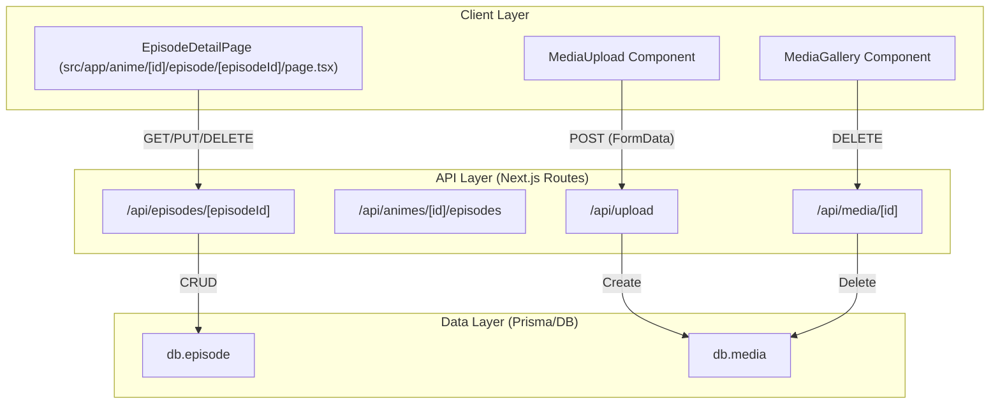

# Episode & Media Management

Relevant source files

The following files were used as context for generating this wiki page:

- [src/app/anime/[id]/episode/[episodeId]/page.tsx](src/app/anime/[id]/episode/[episodeId]/page.tsx)
- [src/app/api/animes/[id]/episodes/route.ts](src/app/api/animes/[id]/episodes/route.ts)
- [src/app/api/episodes/[episodeId]/route.ts](src/app/api/episodes/[episodeId]/route.ts)

The Episode & Media Management system provides users with a granular way to journal their viewing experience. Beyond simply tracking progress, the system allows for detailed "story" entries and the attachment of visual media (images or clips) to specific episodes. This functionality is built on a hierarchical relationship where `Anime` records own multiple `Episode` records, which in turn own multiple `Media` records.

### System Architecture Overview

The interaction between episodes and media is managed through a combination of Next.js API routes and client-side components. The `EpisodeDetailPage` acts as the primary hub for managing these entities, orchestrating data fetching from `/api/episodes/[episodeId]` and delegating media handling to specialized components.

#### Entity Relationship & Flow
The following diagram illustrates how the frontend components interact with the backend API routes and the underlying Prisma `db` entities.

**Episode & Media Data Flow**

**Sources:** [src/app/anime/[id]/episode/[episodeId]/page.tsx:25-194](), [src/app/api/episodes/[episodeId]/route.ts:4-81](), [src/app/api/animes/[id]/episodes/route.ts:4-53]()

---

### Episode Journaling
Episodes are more than just numbers in this system; they serve as a personal journal for the user. Each episode contains a `number`, a `title`, and a `story` field (a long-form text area for notes or summaries) [src/app/api/animes/[id]/episodes/route.ts:34-42]().

*   **Creation**: New episodes are created via a `POST` request to `/api/animes/[id]/episodes` [src/app/api/animes/[id]/episodes/route.ts:27-53]().
*   **Management**: Users can update the episode's metadata or delete the entry entirely through the `EpisodeDetailPage` [src/app/anime/[id]/episode/[episodeId]/page.tsx:54-72]().
*   **Data Structure**: The `Episode` model includes an inline relationship to `Media`, ensuring that when an episode is fetched, its associated gallery is retrieved in a single query [src/app/api/episodes/[episodeId]/route.ts:20-23]().

For details on the episode editing interface and API specifications, see [Episode Pages & API](#5.1).

---

### Media Attachments & Gallery
The media system allows users to upload visual context for their episode notes. This is handled by two primary components: `MediaUpload` for adding new files and `MediaGallery` for displaying and managing existing ones [src/app/anime/[id]/episode/[episodeId]/page.tsx:185-190]().

| Feature | Description | Code Reference |
| :--- | :--- | :--- |
| **Upload** | Handles `FormData` with file, type (image/clip), and caption. | [src/app/anime/[id]/episode/[episodeId]/page.tsx:7-7]() |
| **Storage** | Files are persisted to `public/uploads/` and tracked in the `Media` table. | [src/app/api/episodes/[episodeId]/route.ts:20-22]() |
| **Ordering** | Media records support an `order` field for gallery sequencing. | [src/app/api/animes/[id]/episodes/route.ts:15-15]() |
| **Deletion** | Individual media items can be removed via `DELETE /api/media/[id]`. | [src/app/anime/[id]/episode/[episodeId]/page.tsx:74-77]() |

For details on the upload pipeline and gallery rendering, see [Media Upload & Gallery](#5.2).

---

### Implementation Mapping

The following table maps the natural language features to the specific code symbols and files responsible for their execution.

**Feature to Code Mapping**
| Feature | Code Entity | File Path |
| :--- | :--- | :--- |
| **Episode Detail Fetch** | `db.episode.findUnique` | [src/app/api/episodes/[episodeId]/route.ts:10-24]() |
| **Episode Update** | `db.episode.update` | [src/app/api/episodes/[episodeId]/route.ts:46-58]() |
| **List Anime Episodes** | `db.episode.findMany` | [src/app/api/animes/[id]/episodes/route.ts:10-18]() |
| **UI State Management** | `useState<Episode \| null>` | [src/app/anime/[id]/episode/[episodeId]/page.tsx:28-33]() |
| **Media Deletion** | `handleDeleteMedia` | [src/app/anime/[id]/episode/[episodeId]/page.tsx:74-77]() |

**Sources:** [src/app/api/episodes/[episodeId]/route.ts:1-82](), [src/app/api/animes/[id]/episodes/route.ts:1-54](), [src/app/anime/[id]/episode/[episodeId]/page.tsx:1-195]()

---
