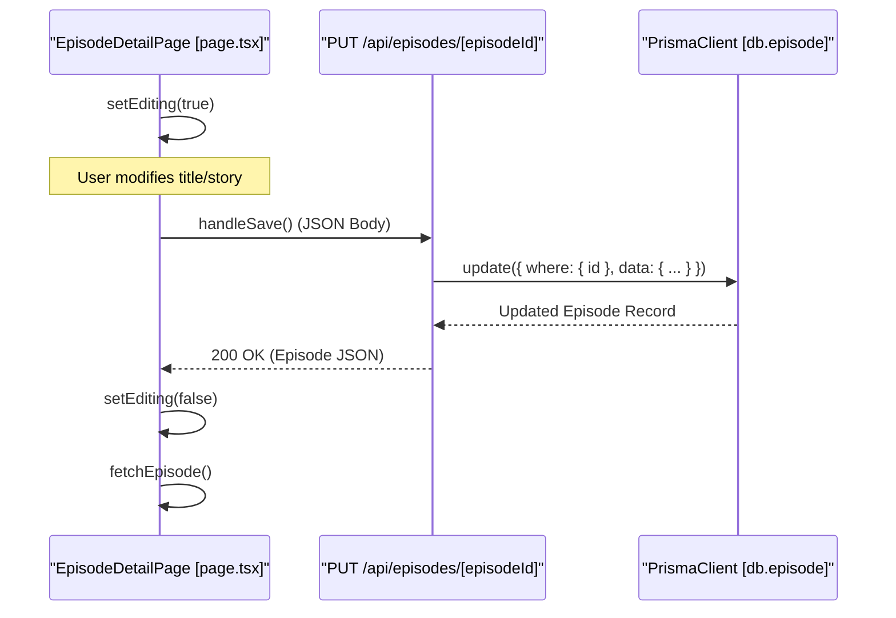

# Episode Pages & API

<details>
<summary>Relevant source files</summary>

The following files were used as context for generating this wiki page:

- [src/app/anime/[id]/episode/[episodeId]/page.tsx](src/app/anime/[id]/episode/[episodeId]/page.tsx)
- [src/app/api/animes/[id]/episodes/route.ts](src/app/api/animes/[id]/episodes/route.ts)
- [src/app/api/episodes/[episodeId]/route.ts](src/app/api/episodes/[episodeId]/route.ts)

</details>


The episode management system provides a detailed journaling interface for tracking progress within an anime series. This includes a dedicated episode detail page with inline editing capabilities and a set of RESTful API routes for CRUD operations on episodes and their associated media.

## Episode Detail Page

The episode detail page is a client-side rendered component located at `src/app/anime/[id]/episode/[episodeId]/page.tsx`. It serves as the primary interface for viewing and modifying episode-specific metadata.

### Data Fetching and State
The page utilizes the `useParams` hook to retrieve the `episodeId` and `id` (anime ID) from the URL [src/app/anime/[id]/episode/[episodeId]/page.tsx:26-27](). It maintains state for the `episode` object, a `loading` flag, and an `editing` toggle [src/app/anime/[id]/episode/[episodeId]/page.tsx:28-30]().

When the component mounts or the `episodeId` changes, it executes `fetchEpisode`, which performs a `GET` request to `/api/episodes/${params.episodeId}` [src/app/anime/[id]/episode/[episodeId]/page.tsx:35-47](). If the episode is not found, the user is redirected back to the main anime detail page [src/app/anime/[id]/episode/[episodeId]/page.tsx:37-40]().

### Inline Editing Workflow
The UI supports a "live edit" mode toggled by the `editing` state [src/app/anime/[id]/episode/[episodeId]/page.tsx:30]().
- **Viewing Mode**: Displays the episode number, title, and the `story` content in a `whitespace-pre-wrap` container to preserve formatting [src/app/anime/[id]/episode/[episodeId]/page.tsx:120-123, 173-175]().
- **Editing Mode**: Swaps text elements for input fields and a `textarea` for the story [src/app/anime/[id]/episode/[episodeId]/page.tsx:103-118, 165-171]().
- **Persistence**: The `handleSave` function sends a `PUT` request to the episode API with the updated `number`, `title`, and `story` [src/app/anime/[id]/episode/[episodeId]/page.tsx:54-66]().

### Media Integration
The episode page integrates two key components for managing visual content:
1.  `MediaGallery`: Displays existing media items associated with the episode [src/app/anime/[id]/episode/[episodeId]/page.tsx:185-188]().
2.  `MediaUpload`: Provides a form to upload new images or clips directly to the current `episodeId` [src/app/anime/[id]/episode/[episodeId]/page.tsx:190]().

**Sources:**
- [src/app/anime/[id]/episode/[episodeId]/page.tsx:1-195]()

## Anime Episodes API (`/api/animes/[id]/episodes`)

This route handles collection-level operations for episodes belonging to a specific anime series.

### GET - List Episodes
Fetches all episodes for a given anime ID, ordered chronologically by episode number.
- **Query**: Filters by `animeId` [src/app/api/animes/[id]/episodes/route.ts:11]().
- **Inclusion**: Includes associated `media` records, ordered by their `order` field [src/app/api/animes/[id]/episodes/route.ts:13-17]().
- **Ordering**: Sorted by `number` in ascending order [src/app/api/animes/[id]/episodes/route.ts:12]().

### POST - Create Episode
Creates a new episode entry for the specified anime.
- **Input Processing**: Automatically handles episode numbers provided as strings by parsing them into integers [src/app/api/animes/[id]/episodes/route.ts:38]().
- **Response**: Returns the created episode including an empty media array [src/app/api/animes/[id]/episodes/route.ts:43-48]().

**Sources:**
- [src/app/api/animes/[id]/episodes/route.ts:1-53]()

## Episode Detail API (`/api/episodes/[episodeId]`)

This route handles operations on individual episode records.

### GET - Fetch Episode Detail
Retrieves a single episode with its parent anime metadata and all associated media.
- **Inclusions**: Fetches `anime` (id, title, coverImage) and `media` (ordered by `order`) [src/app/api/episodes/[episodeId]/route.ts:12-23]().

### PUT - Update Episode
Updates the `number`, `title`, and `story` of an existing episode. Like the POST route, it ensures the `number` is stored as an integer [src/app/api/episodes/[episodeId]/route.ts:46-52]().

### DELETE - Remove Episode
Permanently deletes the episode record [src/app/api/episodes/[episodeId]/route.ts:71-76](). Note that cascading deletes are handled at the database level as defined in the Prisma schema.

**Sources:**
- [src/app/api/episodes/[episodeId]/route.ts:1-81]()

## System Architecture Diagrams

### Data Flow: Episode Update Ceremony
This diagram maps the interaction between the React frontend and the Next.js API routes during an edit operation.


**Sources:**
- [src/app/anime/[id]/episode/[episodeId]/page.tsx:54-66]()
- [src/app/api/episodes/[episodeId]/route.ts:37-65]()

### Code Entity Mapping: Episode Management
This diagram associates natural language concepts with specific code entities and database relations.

```mermaid
graph TD
    subgraph "Frontend Space"
        "Page"["EpisodeDetailPage"]
        "SaveBtn"["handleSave()"]
        "DelBtn"["handleDelete()"]
    end

    subgraph "API Route Space"
        "EpRoute"["/api/episodes/[episodeId]"]
        "AnimeEpRoute"["/api/animes/[id]/episodes"]
    end

    subgraph "Data Space (Prisma)"
        "EpModel"["db.episode"]
        "MediaModel"["db.media"]
        "AnimeModel"["db.anime"]
    end

    "Page" -- "calls" --> "EpRoute"
    "SaveBtn" -- "PUT" --> "EpRoute"
    "DelBtn" -- "DELETE" --> "EpRoute"
    
    "EpRoute" -- "findUnique/update" --> "EpModel"
    "AnimeEpRoute" -- "findMany" --> "EpModel"
    
    "EpModel" -- "belongsTo" --> "AnimeModel"
    "EpModel" -- "hasMany" --> "MediaModel"
```
**Sources:**
- [src/app/anime/[id]/episode/[episodeId]/page.tsx:36,55,70]()
- [src/app/api/episodes/[episodeId]/route.ts:10,46,73]()
- [src/app/api/animes/[id]/episodes/route.ts:10,36]()

---
