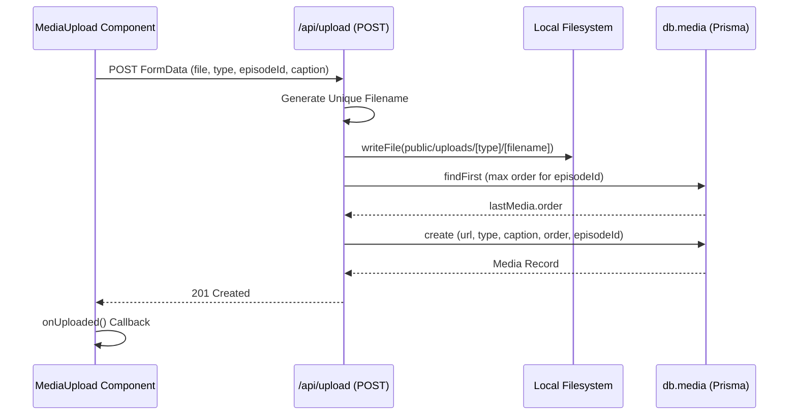
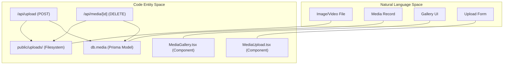

# Media Upload & Gallery

Relevant source files

The following files were used as context for generating this wiki page:

- [src/app/api/media/[id]/route.ts](src/app/api/media/[id]/route.ts)
- [src/app/api/upload/route.ts](src/app/api/upload/route.ts)
- [src/components/MediaGallery.tsx](src/components/MediaGallery.tsx)
- [src/components/MediaUpload.tsx](src/components/MediaUpload.tsx)

The Media Upload and Gallery system allows users to attach visual assets—specifically images and video clips—to individual anime episodes. This subsystem handles multipart form data processing, local filesystem persistence, and database record management to maintain an ordered gallery of media for each episode.

## Media Upload Workflow

The upload process is initiated by the `MediaUpload` client component. It utilizes the browser's `FormData` API to bundle file binaries with metadata before transmitting them to the server.

### Client-Side Implementation: MediaUpload
The `MediaUpload` component [src/components/MediaUpload.tsx:10-86]() manages the user interface for selecting file types and capturing captions. 

*   **Type Selection**: Users toggle between `image` and `clip` types [src/components/MediaUpload.tsx:39-62](). This state controls the `accept` attribute of the file input [src/components/MediaUpload.tsx:66]().
*   **Data Packaging**: The `handleUpload` function [src/components/MediaUpload.tsx:16-33]() constructs a `FormData` object containing:
    *   `file`: The raw binary from the file input [src/components/MediaUpload.tsx:22]().
    *   `episodeId`: The UUID of the parent episode [src/components/MediaUpload.tsx:23]().
    *   `type`: Either "image" or "clip" [src/components/MediaUpload.tsx:24]().
    *   `caption`: Optional text description [src/components/MediaUpload.tsx:25]().
*   **Transmission**: Data is sent via a `POST` request to `/api/upload` [src/components/MediaUpload.tsx:27]().

### Server-Side Processing: /api/upload
The `POST` handler in `src/app/api/upload/route.ts` processes the incoming stream and persists it to the server's disk.

1.  **File Storage**: 
    *   Files are stored in the `public/uploads/` directory, subdivided by type (`images/` or `clips/`) [src/app/api/upload/route.ts:25]().
    *   The system generates a unique filename using `Date.now()` and a random string to prevent collisions [src/app/api/upload/route.ts:30]().
    *   The file is written using `fs.promises.writeFile` [src/app/api/upload/route.ts:33]().
2.  **Order Management**:
    *   The system queries the `db.media` table to find the current highest `order` value for the specific `episodeId` [src/app/api/upload/route.ts:40-46]().
    *   The new record is assigned `max(order) + 1` to ensure it appears last in the gallery [src/app/api/upload/route.ts:45]().
3.  **Database Persistence**: A new `Media` record is created with the generated URL path and metadata [src/app/api/upload/route.ts:51-59]().

### Upload Sequence Diagram

The following diagram illustrates the flow from the UI component to the filesystem and database.

**Sources:** [src/components/MediaUpload.tsx:16-33](), [src/app/api/upload/route.ts:6-66]()

## Media Gallery & Deletion

The gallery provides a responsive grid interface for viewing and managing uploaded assets.

### MediaGallery Component
The `MediaGallery` component [src/components/MediaGallery.tsx:15-56]() renders the assets based on their `type`:
*   **Images**: Rendered via standard `` tags [src/components/MediaGallery.tsx:27-31]().
*   **Clips**: Rendered via `<video>` tags with native browser controls enabled [src/components/MediaGallery.tsx:33-37]().
*   **Interactions**: If an `onDelete` callback is provided, a delete button is revealed on hover (`group-hover:block`) [src/components/MediaGallery.tsx:44-51]().

### Deletion Logic: /api/media/[id]
Deleting media requires a two-step cleanup process to ensure no orphaned files remain on the server.

1.  **File Cleanup**: The handler first retrieves the record to find the file path [src/app/api/media/[id]/route.ts:12-14](). It then attempts to remove the file from the `public/` directory using `fs.promises.unlink` [src/app/api/media/[id]/route.ts:22-23]().
2.  **Record Cleanup**: After the file is removed (or if the file was already missing), the database record is deleted via `db.media.delete` [src/app/api/media/[id]/route.ts:28-30]().

### System Entity Mapping

This diagram maps the logical concepts of media management to their corresponding code entities and storage locations.

**Sources:** [src/components/MediaGallery.tsx:15-56](), [src/app/api/media/[id]/route.ts:6-36]()

## Data Schema Reference

The `Media` entity is defined by its relationship to an `Episode`.

| Field | Type | Description |
| :--- | :--- | :--- |
| `id` | `String` | Primary key (UUID) |
| `url` | `String` | Relative path to the file in `public/` |
| `type` | `String` | Discriminator: "image" or "clip" |
| `caption` | `String?` | Optional user-provided description |
| `order` | `Int` | Sequential position within the episode gallery |
| `episodeId` | `String` | Foreign key to the parent Episode |

**Sources:** [src/app/api/upload/route.ts:51-59](), [src/app/api/media/[id]/route.ts:12-14]()

---
