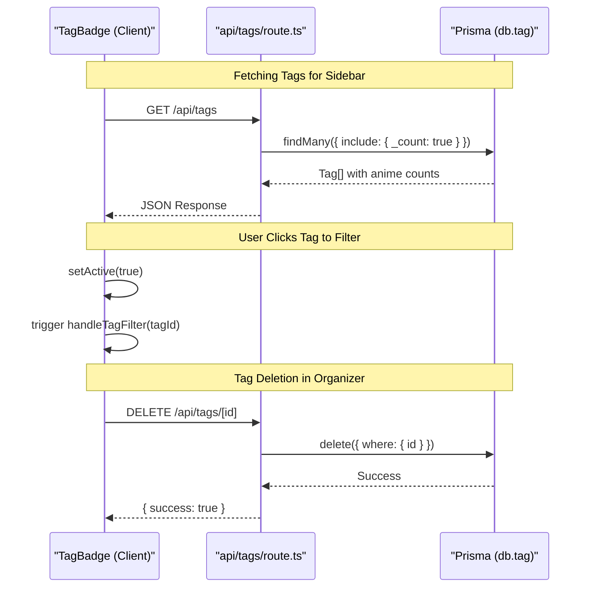

# Tags System

<details>
<summary>Relevant source files</summary>

The following files were used as context for generating this wiki page:

- [src/app/api/tags/[id]/route.ts](src/app/api/tags/[id]/route.ts)
- [src/app/api/tags/route.ts](src/app/api/tags/route.ts)
- [src/components/TagBadge.tsx](src/components/TagBadge.tsx)

</details>


The Tags System provides a flexible categorization layer for the anime library. It allows users to create custom metadata labels (e.g., "Must Watch", "Spring 2024", "Action") that can be associated with multiple anime entries. This system powers the filtering capabilities on the library dashboard and the organization logic in the workspace.

## Data Model & Relationships

Tags are persisted via the `Tag` model in the Prisma schema. Each tag consists of a unique name and a hexadecimal color string used for UI rendering.

### Entity Relationship: Anime to Tag
The relationship between `Anime` and `Tag` is a many-to-many association. This is implemented using an implicit join table managed by Prisma, allowing a single anime to have multiple tags and a single tag to be associated with many anime entries.

#### Tag Data Flow Diagram
This diagram illustrates how the `Tag` entity interacts with the `db` (PrismaClient) and the `Anime` model.

```mermaid
graph TD
    subgraph "Data Layer"
        [db.tag] -- "many-to-many" --- [db.anime]
    end

    subgraph "API Routes"
        "GET /api/tags" -- "findMany" --> [db.tag]
        "POST /api/tags" -- "create" --> [db.tag]
        "DELETE /api/tags/[id]" -- "delete" --> [db.tag]
        "PUT /api/tags/[id]" -- "update" --> [db.tag]
    end

    subgraph "UI Components"
        [TagBadge.tsx] -- "renders" --> [db.tag]
    end
```

**Sources:**
- [src/app/api/tags/route.ts:4-17]() (GET implementation)
- [src/app/api/tags/route.ts:31-36]() (POST implementation)
- [src/app/api/tags/[id]/route.ts:13-16]() (PUT implementation)
- [src/app/api/tags/[id]/route.ts:31-33]() (DELETE implementation)

---

## API Implementation

The system exposes a RESTful interface for managing the tag lifecycle. All tag operations are performed through the `db` instance (PrismaClient).

### Global Tag Operations
Located in `src/app/api/tags/route.ts`, these endpoints handle the collection of tags.

| Method | Endpoint | Description | Implementation Detail |
|:---|:---|:---|:---|
| `GET` | `/api/tags` | Retrieves all tags ordered alphabetically. | Includes an `_count` of associated `animes` for each tag [src/app/api/tags/route.ts:10-15](). |
| `POST` | `/api/tags` | Creates a new tag with a name and optional color. | Defaults to undefined color if not provided [src/app/api/tags/route.ts:31-36](). |

### Individual Tag Operations
Located in `src/app/api/tags/[id]/route.ts`, these endpoints handle specific tag instances.

| Method | Endpoint | Description | Implementation Detail |
|:---|:---|:---|:---|
| `PUT` | `/api/tags/[id]` | Updates the name or color of an existing tag. | Uses `db.tag.update` with the provided `id` [src/app/api/tags/[id]/route.ts:13-16](). |
| `DELETE` | `/api/tags/[id]` | Removes a tag from the database. | Deleting a tag automatically removes it from all associated anime via Prisma's relation handling [src/app/api/tags/[id]/route.ts:31-33](). |

**Sources:**
- [src/app/api/tags/route.ts:1-43]()
- [src/app/api/tags/[id]/route.ts:1-39]()

---

## UI Component: TagBadge

The `TagBadge` component is the primary visual representation of a tag. It is a client-side component (`"use client"`) designed for high reusability across the dashboard, detail pages, and the organizer.

### Implementation Details
The component uses the tag's `color` property to dynamically generate styles. It applies a 20% opacity version of the color for the background and 40% for the border to ensure text readability.

```typescript
// Style calculation logic in TagBadge.tsx
style={{
  backgroundColor: `${color}20`, // 20% opacity hex
  color: color,
  borderColor: color,
  border: `1px solid ${color}40`, // 40% opacity hex
}}
```

### Component Props
The `TagBadgeProps` interface allows the badge to behave as a static label, a clickable filter, or a removable item in a form.

| Prop | Type | Description |
|:---|:---|:---|
| `name` | `string` | The display text of the tag. |
| `color` | `string` | Hex color code (e.g., `#FF0000`). |
| `onClick` | `() => void` | Optional handler; if present, adds `cursor-pointer` and hover effects [src/components/TagBadge.tsx:23](). |
| `active` | `boolean` | If true, applies a ring highlight (used for active filters) [src/components/TagBadge.tsx:24](). |
| `removable` | `boolean` | Shows a "×" button inside the badge [src/components/TagBadge.tsx:34](). |
| `onRemove` | `() => void` | Callback triggered when the "×" button is clicked [src/components/TagBadge.tsx:38](). |

**Sources:**
- [src/components/TagBadge.tsx:3-10]() (Props definition)
- [src/components/TagBadge.tsx:25-30]() (Dynamic styling)
- [src/components/TagBadge.tsx:34-44]() (Removable logic)

---

## System Integration Diagram

This diagram maps the interaction between the frontend components and the backend API routes during tag-based filtering and management.



**Sources:**
- [src/app/api/tags/route.ts:4-17]()
- [src/app/api/tags/[id]/route.ts:25-34]()
- [src/components/TagBadge.tsx:12-47]()

---
