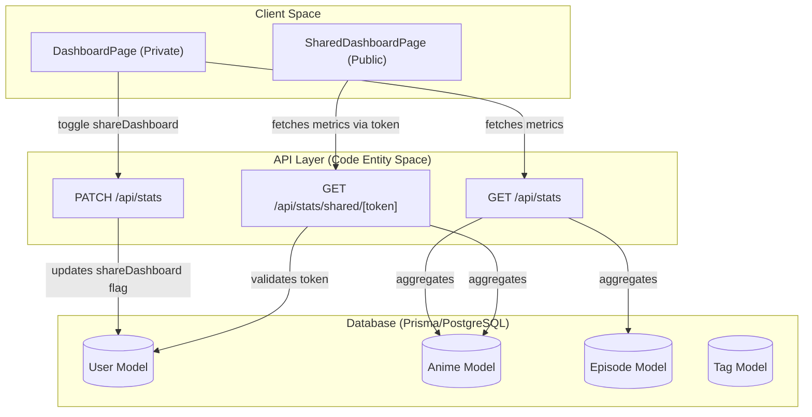
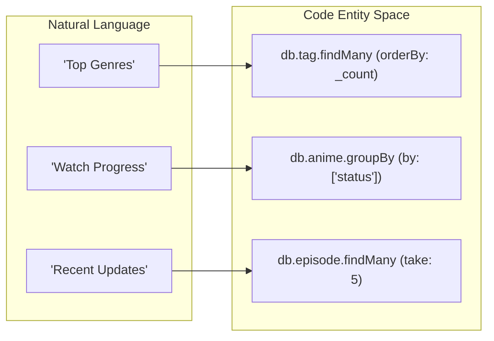

# Dashboard, Stats & Sharing

Relevant source files

The following files were used as context for generating this wiki page:

- [src/app/api/stats/route.ts](src/app/api/stats/route.ts)
- [src/app/api/stats/shared/[token]/route.ts](src/app/api/stats/shared/[token]/route.ts)
- [src/app/dashboard/page.tsx](src/app/dashboard/page.tsx)
- [src/app/shared/[token]/page.tsx](src/app/shared/[token]/page.tsx)

The Dashboard system provides users with a comprehensive analytical overview of their personal anime library. It aggregates data from the `Anime`, `Episode`, and `Tag` models to visualize watch progress, genre preferences, and recent journaling activity. Beyond personal use, the system includes a "Shareable Dashboard" feature that allows users to generate a unique token for a read-only public view of their statistics.

### High-Level Architecture

The dashboard logic is split between a private, authenticated view and a public, token-validated view. Both rely on specialized API routes that perform aggregate database queries.

#### Data Flow Diagram
This diagram illustrates how the `DashboardPage` and `SharedDashboardPage` consume metrics from the Prisma-backed API.

"Dashboard Metrics Data Flow"

**Sources:** [src/app/api/stats/route.ts:5-59](), [src/app/api/stats/shared/[token]/route.ts:4-62](), [src/app/dashboard/page.tsx:48-63]()

---

### Core Components

The dashboard system is organized into two primary user-facing interfaces and their supporting backend logic:

#### 1. Personal Dashboard
The `/dashboard` page is a protected route that serves as the central hub for library intelligence. It features four high-level metric cards: **Total Series**, **Episodes Logged**, **Completed**, and **In Progress**. It also visualizes the distribution of anime statuses (Watching, Completed, Planned, Dropped) and lists the most frequently used tags.

For details, see [Personal Dashboard Page](#7.1).

#### 2. Sharing & Public Access
Users can toggle library sharing via a `PATCH` request to `/api/stats`. When enabled, the `shareDashboard` boolean on the `User` model is set to true, and the user's unique `shareToken` becomes an access key for the public `/shared/[token]` route. This route allows external viewers to see the user's metrics without requiring authentication, while maintaining read-only constraints.

For details, see [Public Shared Dashboard](#7.2).

### Metric Aggregation Logic
The statistics are generated using Prisma's aggregation and grouping features to minimize data transfer.

| Metric | Code Entity / Method | Logic |
| :--- | :--- | :--- |
| **Total Anime** | `db.anime.count` | Counts all records where `userId` matches. |
| **Total Episodes** | `db.episode.count` | Counts episodes linked to the user's anime. |
| **Status Distribution** | `db.anime.groupBy` | Groups by the `status` enum field. |
| **Top Tags** | `db.tag.findMany` | Ordered by `animes` count descending. |
| **Recent Activity** | `db.episode.findMany` | Top 5 records ordered by `createdAt`. |

"Aggregation Logic Mapping"

**Sources:** [src/app/api/stats/route.ts:12-44](), [src/app/api/stats/shared/[token]/route.ts:16-48]()

---

### Sub-Pages

- **[Personal Dashboard Page](#7.1)**
  Detailed breakdown of the `DashboardPage` component, including the state management for `StatsData`, the `toggleSharing` function, and the UI layout for metric cards and progress bars.

- **[Public Shared Dashboard](#7.2)**
  Deep dive into the `shareToken` mechanism, the token validation logic in the shared API route, and the server-side rendering (SSR) implementation of the public dashboard.

**Sources:** [src/app/dashboard/page.tsx:1-121](), [src/app/shared/[token]/page.tsx:1-55](), [src/app/api/stats/route.ts:62-81]()

---
