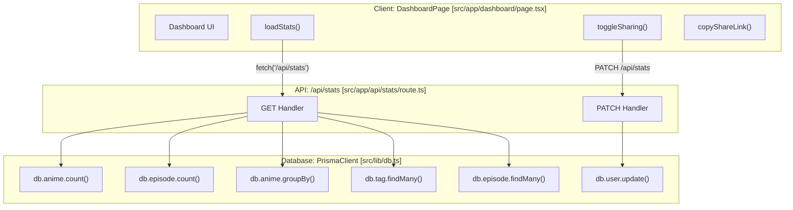
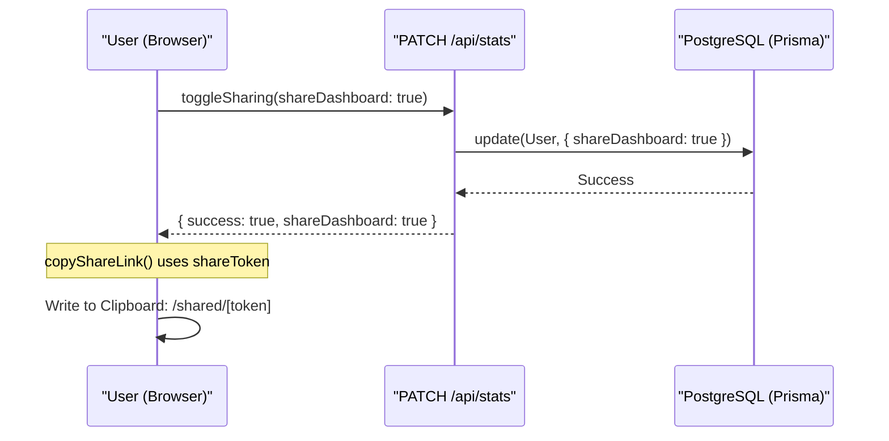

# Personal Dashboard Page

Relevant source files

The following files were used as context for generating this wiki page:

- [src/app/api/stats/route.ts](src/app/api/stats/route.ts)
- [src/app/dashboard/page.tsx](src/app/dashboard/page.tsx)

The Personal Dashboard serves as the central analytics hub for a user's anime collection. It provides a high-level overview of library metrics, watch status distributions, genre preferences, and a chronological log of recent activity. It also facilitates public profile sharing via a toggleable token system.

## Overview and Purpose

The `/dashboard` route is a protected client-side page that aggregates data from several Prisma models (`Anime`, `Episode`, `Tag`, and `User`). It transforms raw database records into digestible visualizations, such as progress bars and metric cards.

### Key Features
- **Metric Cards**: Real-time counts of total series, episodes logged, and specific watch statuses.
- **Status Distribution**: A visual breakdown of library composition (Watching, Completed, Planned, Dropped).
- **Top Genre Tags**: Identification of the most frequently used tags in the user's library.
- **Activity Feed**: A list of the five most recently created episode logs.
- **Dashboard Sharing**: A mechanism to enable/disable public access to these stats via a unique `shareToken`.

## Data Flow and Implementation

The dashboard relies on a dedicated API endpoint `GET /api/stats` to fetch all necessary metrics in a single request.

### Statistics Retrieval Logic
The backend logic in `src/app/api/stats/route.ts` performs multiple asynchronous queries using the Prisma `db` client:

1.  **Count Aggregations**: Uses `db.anime.count` and `db.episode.count` filtered by `userId` [[src/app/api/stats/route.ts:12-15]]().
2.  **Status Grouping**: Uses `db.anime.groupBy` on the `status` field to calculate the distribution of watch states [[src/app/api/stats/route.ts:17-21]]().
3.  **Tag Ranking**: Fetches the top 5 tags ordered by the count of associated anime records [[src/app/api/stats/route.ts:29-35]]().
4.  **Activity Tracking**: Retrieves the 5 most recent episodes, including the parent anime's title for context [[src/app/api/stats/route.ts:37-44]]().

### Dashboard Architecture
The following diagram illustrates the relationship between the UI components and the backend data sources.

**Dashboard Component Data Mapping**

Sources: [[src/app/dashboard/page.tsx:41-93]](), [[src/app/api/stats/route.ts:5-81]]()

## Component Details

### Metric Cards
The top of the dashboard displays four cards representing the core volume of the library. These are calculated from the `StatsData` interface [[src/app/dashboard/page.tsx:26-39]]().
- **Total Series**: Count of all `Anime` records for the user [[src/app/api/stats/route.ts:12]]().
- **Episodes Logged**: Total count of `Episode` records linked to the user's anime [[src/app/api/stats/route.ts:13-15]]().
- **Completed**: Count of anime where `status == 'completed'` [[src/app/api/stats/route.ts:23-27]]().
- **In Progress**: Count of anime where `status == 'watching'` [[src/app/api/stats/route.ts:23-27]]().

### Status Distribution Progress Bars
The dashboard computes percentages for each status relative to the total number of series [[src/app/dashboard/page.tsx:124-127]](). These are rendered as colored progress bars:
- **Completed**: Amber [[src/app/dashboard/page.tsx:179]]()
- **Watching**: Purple [[src/app/dashboard/page.tsx:180]]()
- **Planned**: Blue [[src/app/dashboard/page.tsx:181]]()
- **Dropped**: Rose [[src/app/dashboard/page.tsx:182]]()

### Top Genre Tags
This section displays the most used tags in the collection. The `topTags` array contains the tag name and the count of associated anime [[src/app/dashboard/page.tsx:6-13]](). It renders as a list showing the tag name and a count badge [[src/app/dashboard/page.tsx:206-214]]().

### Recent Activity Feed
The activity feed shows the five most recent `Episode` additions. Each entry displays the anime title and the episode number/title [[src/app/dashboard/page.tsx:231-253]]().

## Dashboard Sharing System

The sharing system allows users to generate a public, read-only version of their dashboard.

### Logic Flow
1.  **Toggle**: The `toggleSharing` function sends a `PATCH` request to `/api/stats` with the desired `shareDashboard` boolean [[src/app/dashboard/page.tsx:69-84]]().
2.  **Persistence**: The backend updates the `User` model's `shareDashboard` field [[src/app/api/stats/route.ts:71-74]]().
3.  **Link Generation**: If enabled, a link is constructed using the user's unique `shareToken` stored in the database [[src/app/dashboard/page.tsx:86-93]]().

**Sharing Mechanism Diagram**

Sources: [[src/app/dashboard/page.tsx:69-93]](), [[src/app/api/stats/route.ts:62-81]]()

## Key Functions and Types

| Entity | Type | Description |
| :--- | :--- | :--- |
| `StatsData` | Interface | Defines the structure of the data returned by the stats API [[src/app/dashboard/page.tsx:26-39]](). |
| `loadStats` | Function | `useCallback` that fetches metrics from `/api/stats` on component mount [[src/app/dashboard/page.tsx:48-63]](). |
| `getPercent` | Function | Helper to calculate percentage of a status relative to total series [[src/app/dashboard/page.tsx:127]](). |
| `toggleSharing` | Function | Asynchronous function to update user's sharing preference via `PATCH` [[src/app/dashboard/page.tsx:69-84]](). |

Sources: [[src/app/dashboard/page.tsx:6-39]](), [[src/app/dashboard/page.tsx:48-93]]()

---
