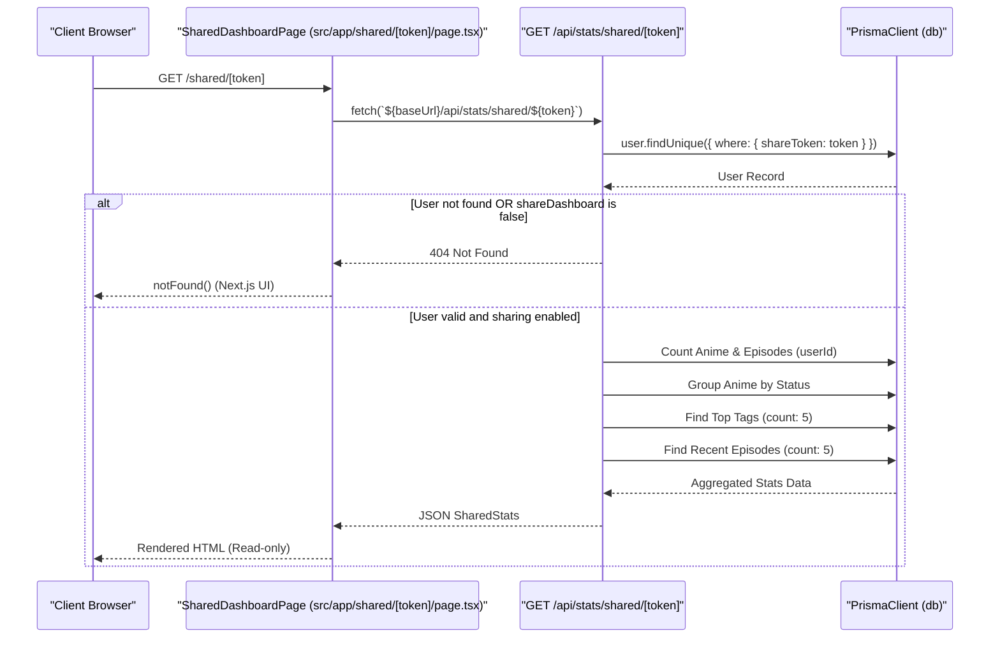
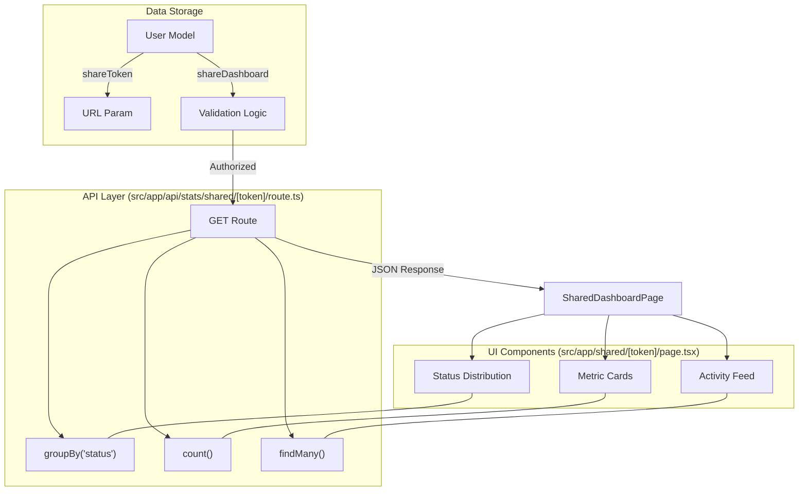

# Public Shared Dashboard

Relevant source files

The following files were used as context for generating this wiki page:

- [src/app/api/stats/shared/[token]/route.ts](src/app/api/stats/shared/[token]/route.ts)
- [src/app/shared/[token]/page.tsx](src/app/shared/[token]/page.tsx)

The Public Shared Dashboard provides a read-only view of a user's anime library metrics and activity. This feature allows users to showcase their watching progress, status distribution, and genre preferences to the public via a unique, non-guessable URL token without requiring viewers to authenticate.

## Data Model & Sharing Mechanism

The sharing functionality is built directly into the `User` model within the database. It relies on two primary fields to manage access control and identity:

| Field | Type | Description |
| :--- | :--- | :--- |
| `shareDashboard` | `Boolean` | A toggle that enables or disables public access to the dashboard. |
| `shareToken` | `String` | A unique identifier (UUID) used as the URL slug for the shared page. |

Access is only granted if `shareDashboard` is true and a valid `shareToken` is provided in the request.

**Sources:**
- [src/app/api/stats/shared/[token]/route.ts:8-14]()

## Data Flow Architecture

The shared dashboard utilizes a decoupled architecture where a server-rendered page fetches data from an internal API route. This ensures that the data logic remains centralized and can be validated consistently.

### Shared Dashboard Logic Flow

The following diagram illustrates the sequence of events when a visitor accesses a shared link.

**Diagram: Shared Dashboard Request Pipeline**

**Sources:**
- [src/app/shared/[token]/page.tsx:28-49]()
- [src/app/api/stats/shared/[token]/route.ts:4-57]()

## API Implementation: `GET /api/stats/shared/[token]`

The API route [src/app/api/stats/shared/[token]/route.ts]() is responsible for verifying the token and performing complex aggregations across multiple models (`User`, `Anime`, `Episode`, `Tag`).

### Data Aggregation Details

1.  **Identity Verification**: It first looks up the user by `shareToken`. If the `shareDashboard` flag is `false`, it returns a 404 to prevent unauthorized leaks [src/app/api/stats/shared/[token]/route.ts:8-14]().
2.  **Global Counts**: It calculates `totalAnime` and `totalEpisodes` scoped to the specific `userId` [src/app/api/stats/shared/[token]/route.ts:16-19]().
3.  **Status Distribution**: Uses Prisma's `groupBy` on the `Anime` model to count entries for each status (watching, completed, planned, dropped) [src/app/api/stats/shared/[token]/route.ts:21-31]().
4.  **Top Genres**: Fetches the top 5 `Tag` records, ordered by the count of associated anime [src/app/api/stats/shared/[token]/route.ts:33-39]().
5.  **Activity Feed**: Retrieves the 5 most recently created `Episode` records, including the parent `Anime` title for context [src/app/api/stats/shared/[token]/route.ts:41-48]().

**Sources:**
- [src/app/api/stats/shared/[token]/route.ts:1-62]()

## Frontend Presentation: `SharedDashboardPage`

The shared page is a server-rendered component located at [src/app/shared/[token]/page.tsx](). It is designed as a read-only version of the personal dashboard, omitting management controls and private user settings.

### Key Components

*   **Hero Banner**: Displays the owner's email (truncated) and a "Shared Library" badge to indicate the public nature of the view [src/app/shared/[token]/page.tsx:59-74]().
*   **Metric Cards**: A grid showing "Total Series", "Episodes Logged", "Completed", and "In Progress" counts with distinct gradients [src/app/shared/[token]/page.tsx:77-97]().
*   **Status Distribution Bars**: Visual progress bars calculating the percentage of the library occupied by each status category [src/app/shared/[token]/page.tsx:102-128]().
*   **Top Genre Tags**: A list of tags showing the specific count of series per genre [src/app/shared/[token]/page.tsx:130-152]().
*   **Recent Activity Feed**: A chronological list of the latest episodes added to the user's journal [src/app/shared/[token]/page.tsx:156-161]().

### Technical Interface
The page defines several interfaces to type-check the incoming API data:
*   `SharedStats`: The root object containing all metrics [src/app/shared/[token]/page.tsx:19-26]().
*   `TagStat`: Details for genre display including name, color, and count [src/app/shared/[token]/page.tsx:4-9]().
*   `Activity`: Details for the episode feed [src/app/shared/[token]/page.tsx:11-17]().

**Sources:**
- [src/app/shared/[token]/page.tsx:4-161]()

## Code Entity Mapping

The following diagram maps the logical dashboard components to their corresponding code entities and database fields.

**Diagram: Component to Code Mapping**

**Sources:**
- [src/app/api/stats/shared/[token]/route.ts:4-57]()
- [src/app/shared/[token]/page.tsx:41-56]()

---
