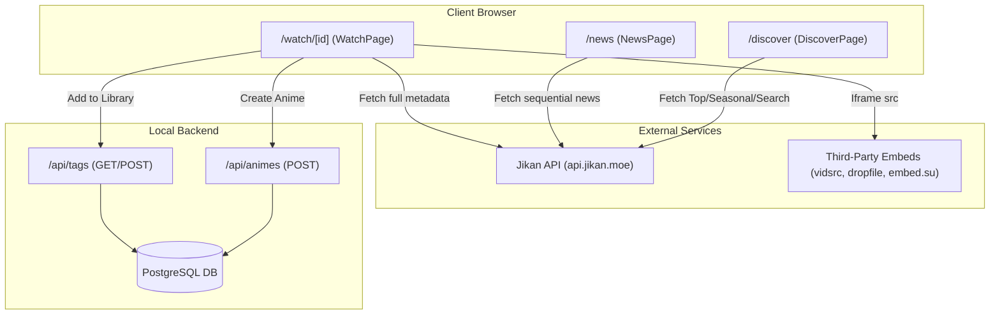

# Discovery, Watch Player & News

Relevant source files

The following files were used as context for generating this wiki page:

- [src/app/discover/page.tsx](src/app/discover/page.tsx)
- [src/app/news/page.tsx](src/app/news/page.tsx)
- [src/app/watch/[id]/page.tsx](src/app/watch/[id]/page.tsx)

The Discovery, Watch Player, and News subsystems provide a public-facing entry point into the anime ecosystem. These features leverage the external **Jikan API** (a REST API for MyAnimeList) to provide live data without requiring local database records or user authentication. Users can browse the global anime catalog, stream content via third-party embeds, and stay updated with industry news.

## System Architecture: Public Features

The following diagram illustrates how the public pages interact with the Jikan API and the local application database.

### Public Feature Data Flow

**Sources:** [src/app/discover/page.tsx:30-53](), [src/app/watch/[id]/page.tsx:46-62](), [src/app/news/page.tsx:71-103]()

---

## Discover Browser
The Discover page ([src/app/discover/page.tsx]()) serves as a gateway to the MyAnimeList encyclopedia. It allows users to browse through different categories and perform global searches.

*   **Tabs:** Provides pre-defined filters for "Top Rated", "Seasonal", and "Movies" by hitting specific Jikan endpoints [src/app/discover/page.tsx:55-63]().
*   **Search:** A form-based search that queries the Jikan `/v4/anime?q=` endpoint [src/app/discover/page.tsx:65-70]().
*   **Genre Filtering:** Extracts unique genres from the current API result set to allow client-side refinement [src/app/discover/page.tsx:40-46]().

For details, see [Discover Page](#8.1).

**Sources:** [src/app/discover/page.tsx:6-19](), [src/app/discover/page.tsx:101-119]()

---

## Watch Player
The Watch page ([src/app/watch/[id]/page.tsx]()) provides a "theater mode" experience for any anime ID found in the global database.

*   **Multi-Server Support:** Offers three different embed providers (dropfile.cc, vidsrc.me, and embed.su) to ensure stream availability [src/app/watch/[id]/page.tsx:112-129]().
*   **Episode Navigation:** A grid-based selector allows users to switch between episodes, which dynamically updates the iframe `src` [src/app/watch/[id]/page.tsx:219-234]().
*   **Library Integration:** Users can persist the current anime to their local library. This process automatically checks for existing tags or creates new ones (e.g., status tags like "watching" or genre tags) before calling the internal POST `/api/animes` endpoint [src/app/watch/[id]/page.tsx:131-185]().

For details, see [Watch Player Page](#8.2).

**Sources:** [src/app/watch/[id]/page.tsx:7-23](), [src/app/watch/[id]/page.tsx:195-201]()

---

## News Hub
The News Hub ([src/app/news/page.tsx]()) aggregates live updates for popular franchises to keep users engaged with current industry trends.

*   **Sequential Aggregation:** To avoid Jikan API rate limits, the system fetches news for a hardcoded list of popular anime (e.g., One Piece, Jujutsu Kaisen) sequentially with a 350ms delay between requests [src/app/news/page.tsx:76-103]().
*   **Fallback Mechanism:** If the API is unreachable or rate-limited, the page displays a set of `fallbackNews` articles to ensure the UI is never empty [src/app/news/page.tsx:28-53]().
*   **Article Cards:** News items are rendered in a responsive grid, displaying the title, category (anime name), date, and a brief excerpt [src/app/news/page.tsx:148-171]().

For details, see [News Hub Page](#8.3).

### News Entity Mapping
| Code Entity | Purpose | Source |
| :--- | :--- | :--- |
| `JikanNewsItem` | Interface for raw Jikan API response | [src/app/news/page.tsx:5-17]() |
| `NewsArticle` | Unified internal interface for news items | [src/app/news/page.tsx:19-26]() |
| `popularAnime` | Array of MAL IDs used for news aggregation | [src/app/news/page.tsx:57-63]() |
| `fetchLiveNews` | Core logic for sequential API fetching | [src/app/news/page.tsx:71-120]() |

**Sources:** [src/app/news/page.tsx:98-99](), [src/app/news/page.tsx:109-112]()

---
