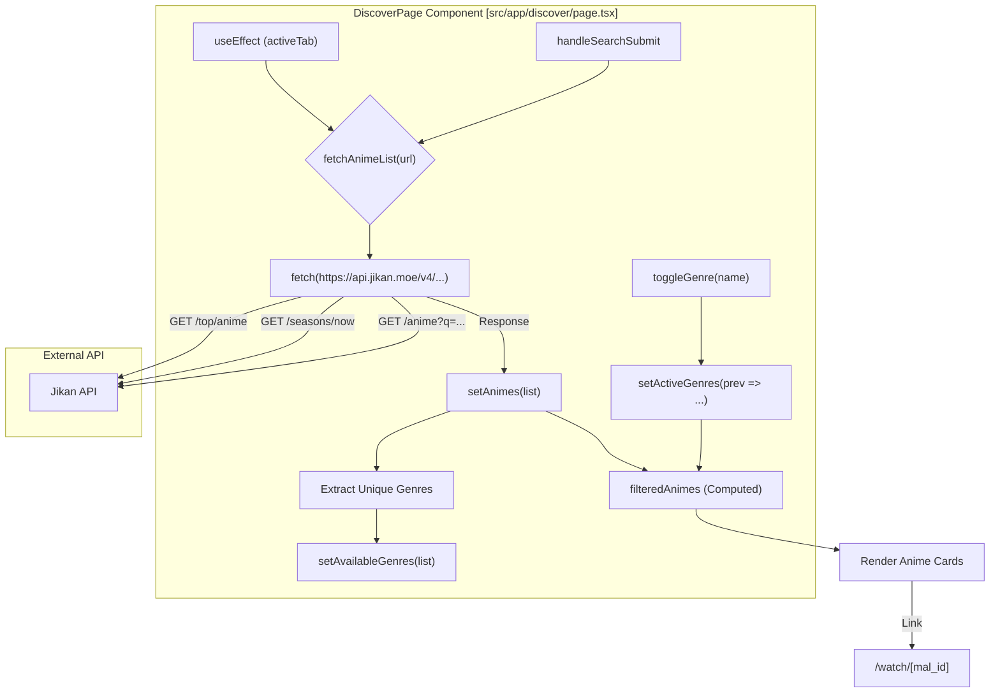
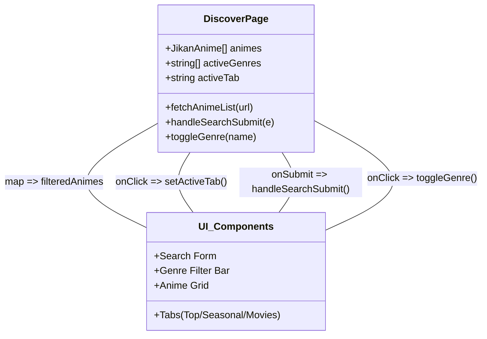

# Discover Page

Relevant source files

The following files were used as context for generating this wiki page:

- [src/app/discover/page.tsx](src/app/discover/page.tsx)

The Discover page (`/discover`) serves as the application's portal to the global anime ecosystem. It leverages the **Jikan API** (a REST API for MyAnimeList) to provide users with real-time data on top-rated series, current seasonal releases, and movies. Unlike the library pages, the Discover page is public-facing and does not require authentication to browse.

## Implementation Overview

The page is implemented as a Client Component to handle dynamic state transitions, such as tab switching, search queries, and client-side genre filtering.

### Data Flow and State Management
The page manages its lifecycle through several key state variables:
- `animes`: Stores the raw list of `JikanAnime` objects fetched from the API [src/app/discover/page.tsx:22-22]().
- `activeTab`: Tracks the current category (`top`, `seasonal`, `movies`, or `search`) [src/app/discover/page.tsx:25-25]().
- `availableGenres`: A derived set of unique genres found within the current result set, used to populate the filter bar [src/app/discover/page.tsx:28-28]().
- `activeGenres`: An array of strings representing the genres the user has selected to filter the current view [src/app/discover/page.tsx:27-27]().

### Discover Page Data Orchestration
The following diagram illustrates how the `DiscoverPage` component interacts with the Jikan API and manages internal state.

**Sources:** [src/app/discover/page.tsx:21-81]()

## Core Functionality

### 1. Tabbed Browsing
The page provides three default categories that trigger fetches to specific Jikan endpoints:
- **Top Rated**: Fetches from `https://api.jikan.moe/v4/top/anime` [src/app/discover/page.tsx:57-57]().
- **Seasonal**: Fetches current season data from `https://api.jikan.moe/v4/seasons/now` [src/app/discover/page.tsx:59-59]().
- **Movies**: Fetches anime filtered by type from `https://api.jikan.moe/v4/anime?type=movie` [src/app/discover/page.tsx:61-61]().

### 2. Global Search
The search form allows users to query the entire MyAnimeList database. When a search is submitted via `handleSearchSubmit`, the `activeTab` is set to `"search"` and the `fetchAnimeList` function is called with a URL-encoded query parameter `?q=` [src/app/discover/page.tsx:65-70]().

### 3. Client-Side Genre Filtering
To provide a responsive experience, genre filtering is performed locally on the results already fetched from the API:
- **Extraction**: Upon every successful fetch, the component iterates through the `animes` list to extract a unique set of genres [src/app/discover/page.tsx:41-45]().
- **Filtering**: The `filteredAnimes` constant uses the `.every()` and `.some()` array methods to ensure that every selected genre in `activeGenres` is present in the anime's genre list [src/app/discover/page.tsx:79-81]().

### 4. Routing to Watch Player
Each anime card includes a "Watch Now" link. This link routes the user to the `/watch/[mal_id]` page, passing the MyAnimeList ID as a dynamic route parameter [src/app/discover/page.tsx:213-217]().

**Sources:** [src/app/discover/page.tsx:55-81](), [src/app/discover/page.tsx:213-217]()

## Technical Entity Mapping

The following diagram maps UI interactions to the specific functions and state variables within the `DiscoverPage` implementation.

**Sources:** [src/app/discover/page.tsx:21-81]()

## Error Handling and Rate Limiting
The Jikan API has strict rate limits. The `fetchAnimeList` function includes a `try-catch` block that handles non-OK responses (such as HTTP 429 Too Many Requests) by setting an error state, which is then displayed to the user [src/app/discover/page.tsx:30-53]().

| State | UI Behavior |
| :--- | :--- |
| `loading === true` | Renders a skeleton grid of 12 pulse-animated cards [src/app/discover/page.tsx:165-176](). |
| `error !== ""` | Displays a red error message asking the user to refresh [src/app/discover/page.tsx:180-184](). |
| `filteredAnimes.length === 0` | Displays a "No results found" message [src/app/discover/page.tsx:188-193](). |

**Sources:** [src/app/discover/page.tsx:30-53](), [src/app/discover/page.tsx:165-193]()

---
