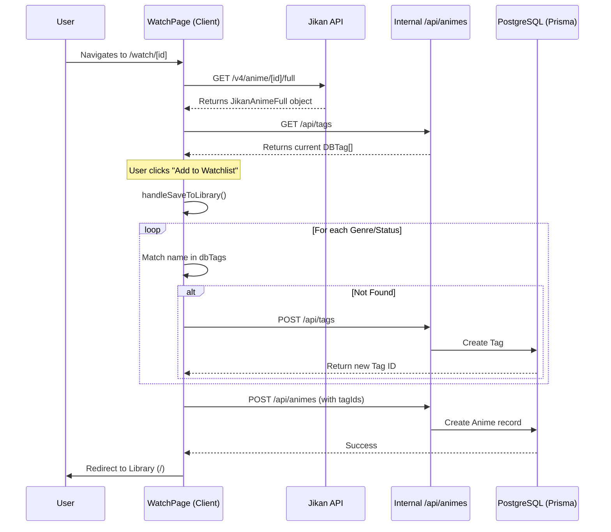
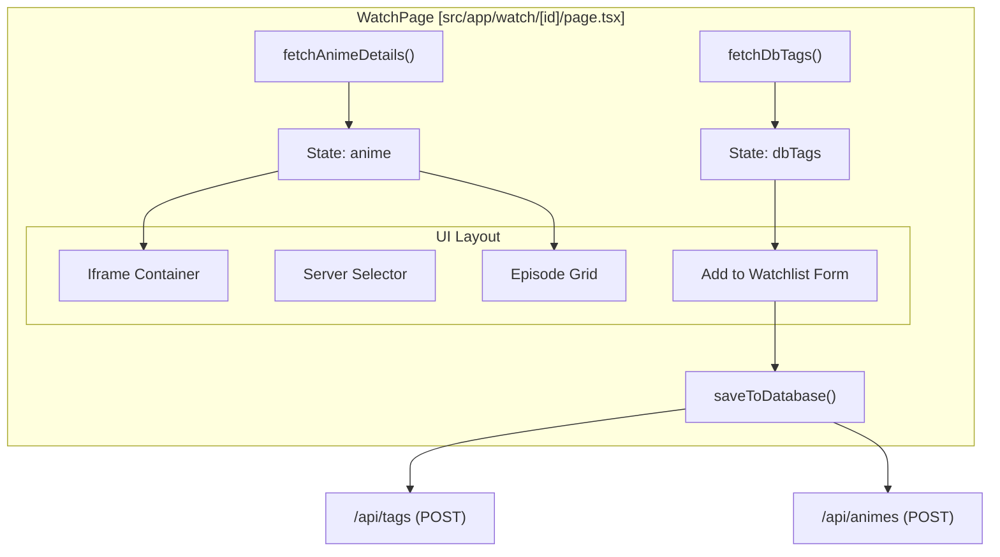

# Watch Player Page

Relevant source files

The following files were used as context for generating this wiki page:

- [src/app/watch/[id]/page.tsx](src/app/watch/[id]/page.tsx)

The Watch Player page (`/watch/[id]`) provides a unified streaming interface for anime discovered via the Jikan API. It integrates third-party video embeds, dynamic episode navigation, and a direct "Add to Library" pipeline that synchronizes external metadata with the local application database.

## Implementation Overview

The page is a Client Component that utilizes the `id` parameter (representing the MyAnimeList ID) to fetch exhaustive metadata. It maintains internal state for the current viewing session (episode and server selection) and facilitates the transition of data from the public Jikan API to the authenticated user's personal library.

### Core Data Fetching
Upon initialization, the component executes two primary data-fetching operations:
1.  **Jikan API Fetch**: Retrieves full anime details, including synopsis, genres, and episode counts, from the `/v4/anime/:id/full` endpoint [src/app/watch/[id]/page.tsx:46-62]().
2.  **Internal Tags Fetch**: Retrieves existing tags from `/api/tags` to prevent duplication when the user adds the anime to their library [src/app/watch/[id]/page.tsx:65-75]().

### Player Logic & Embeds
The page dynamically constructs an `embedUrl` based on the selected server and episode number. It supports three external providers:
*   **Server 1**: `dropfile.cc` [src/app/watch/[id]/page.tsx:115]().
*   **Server 2**: `vidsrc.me` [src/app/watch/[id]/page.tsx:117]().
*   **Server 3**: `embed.su` [src/app/watch/[id]/page.tsx:119]().

The iframe is restricted via a `sandbox` attribute to `allow-scripts allow-same-origin allow-forms` for security [src/app/watch/[id]/page.tsx:199]().

**Sources:** [src/app/watch/[id]/page.tsx:1-201]()

## System Data Flow

The following diagram illustrates how the Watch Player bridges external API data with the internal database.

### Data Synchronization Flow
Title: External to Internal Data Bridge

**Sources:** [src/app/watch/[id]/page.tsx:46-185]()

## Key Features

### Episode Selection Grid
For series (non-movies), the page renders a grid of buttons corresponding to the total episode count returned by Jikan [src/app/watch/[id]/page.tsx:109](). Clicking an episode updates the `currentEpisode` state, which re-calculates the `embedUrl` [src/app/watch/[id]/page.tsx:121-129]().

### Library Integration Flow
The `saveToDatabase` function implements a complex synchronization logic:
1.  **Tag Matching**: It extracts genres from the Jikan response and combines them with the user-selected `watchlistStatus` [src/app/watch/[id]/page.tsx:135-136]().
2.  **On-the-fly Tag Creation**: If a genre or status tag does not exist in the local database, it is automatically created via a POST request to `/api/tags` with a status-specific color coding [src/app/watch/[id]/page.tsx:140-157]().
3.  **Anime Persistence**: Finally, it POSTs the anime metadata (title, synopsis, cover image) and the gathered `tagIds` to the `/api/animes` endpoint [src/app/watch/[id]/page.tsx:160-170]().

### Component Architecture
Title: Watch Player Component Structure

**Sources:** [src/app/watch/[id]/page.tsx:31-205]()

## Technical Details

| Feature | Implementation |
| :--- | :--- |
| **Routing** | Dynamic Next.js route using `useParams()` [src/app/watch/[id]/page.tsx:32]() |
| **State Management** | React `useState` for loading, error, anime data, current episode, and server [src/app/watch/[id]/page.tsx:36-44]() |
| **Security** | Iframe sandboxing and `rel="noopener noreferrer"` on external links |
| **User Experience** | Loading spinner during API fetch [src/app/watch/[id]/page.tsx:84-93](); Error state with fallback to Discover page [src/app/watch/[id]/page.tsx:95-106]() |

**Sources:** [src/app/watch/[id]/page.tsx:1-205]()

---
