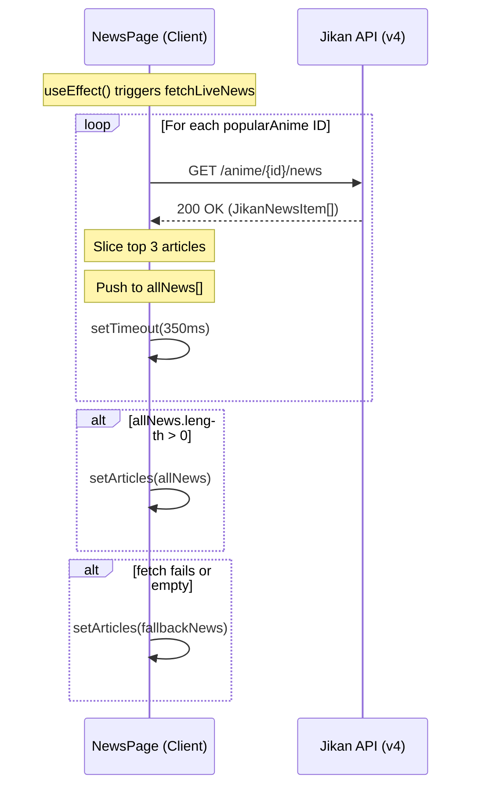
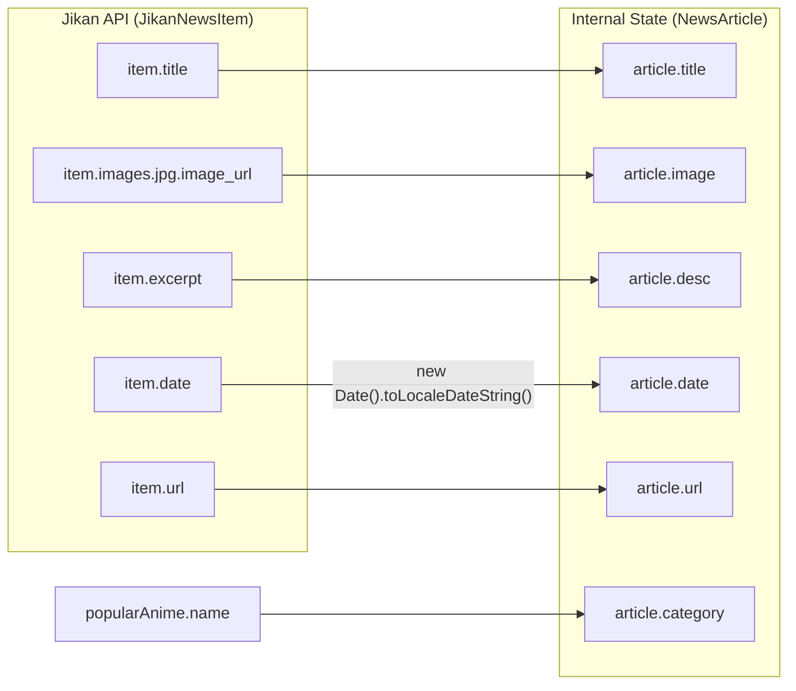

# News Hub Page

Relevant source files

The following files were used as context for generating this wiki page:

- [src/app/news/page.tsx](src/app/news/page.tsx)

The **News Hub Page** (`/news`) serves as a public-facing aggregator of live anime news, sourcing data from the Jikan API (MyAnimeList). It provides a curated feed of updates for specific popular franchises while implementing rate-limit mitigation strategies to ensure reliable data retrieval.

## Data Fetching Architecture

The page uses a client-side `useEffect` hook to aggregate news from multiple specific anime IDs. To avoid triggering the Jikan API's rate limits (403 errors), the system employs a sequential fetching strategy with artificial delays between requests.

### Key Data Entities
The implementation relies on two primary interfaces to manage data flow:
*   `JikanNewsItem`: Represents the raw response structure from the Jikan API [src/app/news/page.tsx:5-17]().
*   `NewsArticle`: The internal normalized format used to render the UI cards [src/app/news/page.tsx:19-26]().

### Targeted Anime
The aggregator specifically targets five high-profile series to ensure the feed remains relevant to a broad audience:
| Anime Name | Jikan ID |
| :--- | :--- |
| One Piece | 21 |
| Demon Slayer | 38000 |
| Jujutsu Kaisen | 40748 |
| Chainsaw Man | 44511 |
| Attack on Titan | 16498 |

Sources: [src/app/news/page.tsx:57-63]()

### Fetching Logic Flow
The `fetchLiveNews` function iterates through the `popularAnime` array. For each entry, it performs a `fetch` to the `/v4/anime/{id}/news` endpoint [src/app/news/page.tsx:78]().

**Sequence Diagram: Sequential News Aggregation**
Title: "News Aggregation Sequence"

Sources: [src/app/news/page.tsx:71-123]()

## Implementation Details

### Rate Limit Mitigation
Because the Jikan API has strict rate limits, the `NewsPage` component implements a sequential loop rather than `Promise.all`. It uses a `350ms` delay between iterations [src/app/news/page.tsx:99]() to ensure compliance with the API's requests-per-second constraints.

### Fallback Mechanism
If the API requests fail or return no data, the application switches to a `fallbackNews` array [src/app/news/page.tsx:28-53](). This ensures the UI never appears broken to the user. The state variable `usingFallback` is updated to reflect this, changing the Hero Banner text from "Live MyAnimeList Feed" to "Featured Updates" [src/app/news/page.tsx:130]().

### UI Components
The page is rendered as a responsive grid of cards:
*   **Hero Banner**: Displays the source status and page title [src/app/news/page.tsx:128-138]().
*   **Loading State**: A spinner is shown while the sequential fetch is in progress [src/app/news/page.tsx:140-144]().
*   **Article Cards**: Each card displays an image, a category (the anime name), a formatted date, a title, and an excerpt [src/app/news/page.tsx:147-172]().

**Entity Mapping: API to UI**
Title: "Data Mapping: Jikan API to NewsArticle"

Sources: [src/app/news/page.tsx:5-26](), [src/app/news/page.tsx:83-96]()

## Key Functions and State

| Entity | Type | Description |
| :--- | :--- | :--- |
| `articles` | `useState<NewsArticle[]>` | Stores the final list of news items to render [src/app/news/page.tsx:66](). |
| `loading` | `useState<boolean>` | Controls the visibility of the aggregation spinner [src/app/news/page.tsx:67](). |
| `fetchLiveNews` | `async function` | Orchestrates the sequential API calls and fallback logic [src/app/news/page.tsx:71](). |
| `fallbackNews` | `const NewsArticle[]` | Static data used when the Jikan API is unreachable [src/app/news/page.tsx:28](). |

Sources: [src/app/news/page.tsx:28-123]()

---
