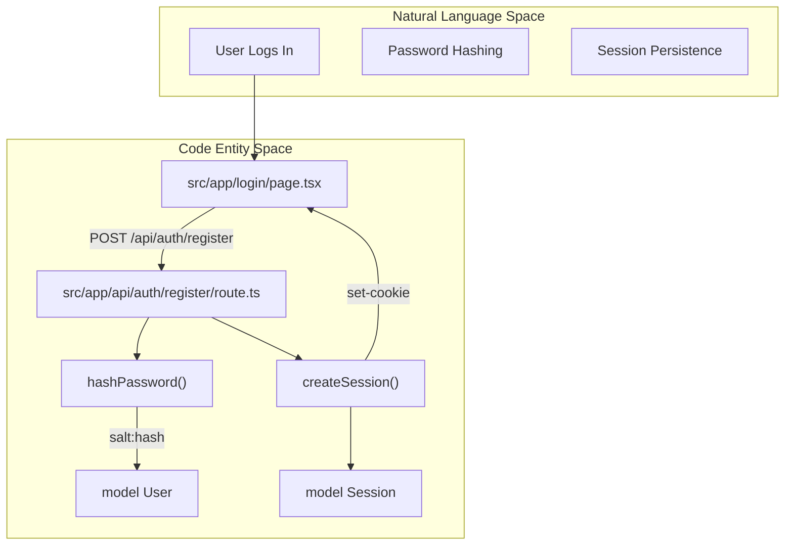
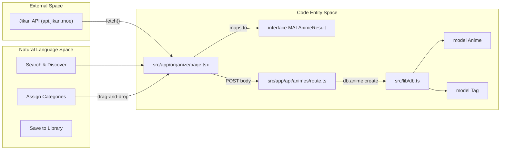

# Glossary

Relevant source files

The following files were used as context for generating this wiki page:

- [package.json](package.json)
- [prisma/schema.prisma](prisma/schema.prisma)
- [src/app/anime/new/page.tsx](src/app/anime/new/page.tsx)
- [src/app/api/animes/[id]/route.ts](src/app/api/animes/[id]/route.ts)
- [src/app/api/animes/route.ts](src/app/api/animes/route.ts)
- [src/app/api/auth/passkey/route.ts](src/app/api/auth/passkey/route.ts)
- [src/app/api/auth/register/route.ts](src/app/api/auth/register/route.ts)
- [src/app/layout.tsx](src/app/layout.tsx)
- [src/app/login/page.tsx](src/app/login/page.tsx)
- [src/app/organize/page.tsx](src/app/organize/page.tsx)
- [src/app/page.tsx](src/app/page.tsx)
- [src/lib/auth.ts](src/lib/auth.ts)
- [src/lib/db.ts](src/lib/db.ts)
- [src/middleware.ts](src/middleware.ts)

This page provides definitions for codebase-specific terms, domain concepts, and technical abbreviations used throughout the Animeverse project. It serves as a reference for onboarding engineers to understand the implementation details and data flow within the system.

## Core Domain Concepts

### Anime Entry
A personal record of an anime series or movie stored in the user's library. Unlike the global Jikan API data, an `Anime` entity in this system is scoped to a specific `User` and includes personal metadata like `status` (watching, completed, etc.) and custom `tags`.
*   **Implementation**: Defined as the `Anime` model in the Prisma schema [prisma/schema.prisma:45-57]().
*   **Data Flow**: Created via `POST /api/animes` [src/app/api/animes/route.ts:62-94]() and updated via `PUT /api/animes/[id]` [src/app/api/animes/[id]/route.ts:40-80]().

### Organizer Workspace
A specialized interface located at `/organize` that allows users to bridge external metadata from the Jikan API into their local database using interactive mechanics.
*   **Key Feature**: Uses a drag-and-drop workflow to assign `DBTag` entities to a `MALAnimeResult` before committing the data to the local `db.anime` table [src/app/organize/page.tsx:122-188]().

### Passkey (WebAuthn)
A passwordless authentication method using FIDO2/WebAuthn standards. It allows users to log in using biometric sensors or hardware security keys.
*   **Implementation**: Uses `@simplewebauthn/server` for verification [package.json:15]() and stores credentials in the `Passkey` model [prisma/schema.prisma:28-35]().
*   **Logic**: Managed through the `handlePasskeyRegister` and `handlePasskeyLogin` functions in the frontend [src/app/login/page.tsx:127-188]().

---

## Technical Terms & Abbreviations

| Term | Definition | Code Pointer |
| :--- | :--- | :--- |
| **CUID** | Collision-resistant Unique Identifier used as the primary key for all database models. | [prisma/schema.prisma:14]() |
| **Jikan API** | An open-source PHP & REST API for "MyAnimeList" used for discovery and metadata. | [src/app/layout.tsx:37]() |
| **MAL ID** | The unique identifier for an anime on MyAnimeList, used to fetch external data. | [src/app/organize/page.tsx:13]() |
| **OTP** | One-Time Password used for "Magic Link" style email authentication. | [prisma/schema.prisma:17-18]() |
| **PBKDF2** | Password-Based Key Derivation Function 2, used for secure password hashing. | [src/app/api/auth/register/route.ts:6-8]() |
| **Session Token** | A unique string stored in a `httpOnly` cookie to maintain user authentication. | [src/lib/auth.ts]() |

---

## System Architecture & Data Flow

The following diagrams illustrate the relationship between natural language concepts and the specific code entities that implement them.

### Authentication & Session Lifecycle
This diagram maps the authentication process from the UI components to the underlying database models and utility functions.

**Auth Flow: UI to DB**

**Sources**: [src/app/login/page.tsx:63-81](), [src/app/api/auth/register/route.ts:6-49](), [prisma/schema.prisma:13-26](), [prisma/schema.prisma:37-43]()

### Anime Management Pipeline
This diagram tracks how an anime moves from an external search result to a persisted entity in the user's library.

**Data Pipeline: External to Internal**

**Sources**: [src/app/organize/page.tsx:12-26](), [src/app/organize/page.tsx:105-119](), [src/app/organize/page.tsx:159-169](), [src/app/api/animes/route.ts:75-87](), [src/lib/db.ts:1-7]()

---

## Database Model Definitions

### User & Auth
*   **User**: The central entity representing an account. Stores `passwordHash` (PBKDF2) and `otpCode` for authentication [prisma/schema.prisma:13-26]().
*   **Session**: Represents an active login. Linked to a `User` and contains an `expiresAt` timestamp [prisma/schema.prisma:37-43]().
*   **Passkey**: Stores WebAuthn public keys and counters associated with a user [prisma/schema.prisma:28-35]().

### Library & Content
*   **Anime**: The primary container for a series. Includes a many-to-many relationship with `Tag` [prisma/schema.prisma:45-57]().
*   **Episode**: A specific entry within an anime. Uses a composite unique constraint on `[animeId, number]` to prevent duplicate episode numbers [prisma/schema.prisma:59-71]().
*   **Media**: Attachments (images or clips) linked to an episode. Includes an `order` field for gallery sequencing [prisma/schema.prisma:73-82]().
*   **Tag**: A reusable label (e.g., "Shonen", "Cyberpunk") with a custom hex `color`. Shared across the `AnimeToTag` relation [prisma/schema.prisma:84-89]().

**Sources**: [prisma/schema.prisma:1-90]()

## Middleware & Routing
*   **Public Paths**: Routes like `/login`, `/news`, and `/discover` that bypass the authentication check [src/middleware.ts:4-9]().
*   **Route Guard**: The `middleware.ts` logic that checks for the existence of a `session` cookie before allowing access to protected routes [src/middleware.ts:41-49]().
*   **API Multi-tenancy**: All private API routes fetch the `userId` via `getCurrentUser(request)` to ensure users can only access their own data [src/app/api/animes/route.ts:7-10]().

**Sources**: [src/middleware.ts:1-58](), [src/app/api/animes/route.ts:5-10]()
